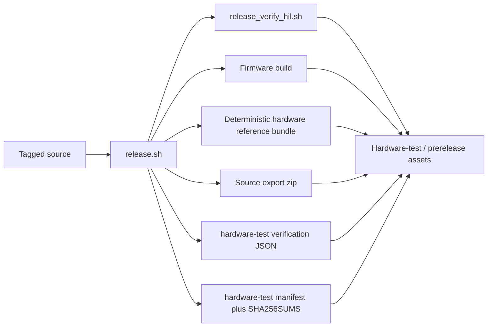

# Reproducibility

This page is the short version of the release artifact story. The detailed, root-level operator document still lives in [`REPRODUCIBILITY.md`](https://github.com/bseverns/MOARkNOBS-42/blob/main/REPRODUCIBILITY.md), but this page keeps the essential flow inside the docs site.

## Why this matters

MOARkNOBS-42 does not just ship binaries. It tries to ship receipts. At the current boundary, these are **hardware-test/prerelease** receipts, not beta/public release claims:

- the hardware-test firmware artifact
- the hardware-test hardware reference bundle, not an orderable fabrication bundle
- a deterministic hardware-test source export
- a frozen browser App bundle tied to the release commit
- a hardware-test manifest describing how those artifacts were built
- hardware-test checksums so another machine can verify the output
- unsigned bridge binaries with per-target checksums; beta/public bridge assets must pass the signing gate

That matters because this project wants to be teachable and inspectable, not just downloadable.

## Release artifact flow



## Local release command

From the repo root:

```bash
FW_VERSION=vX.Y.Z ./release.sh vX.Y.Z
```

Two things matter there:

- the positional argument names the artifacts
- the `FW_VERSION` environment variable ensures the embedded firmware metadata reports the same version as the tagged release
- HIL execution is recorded in `dist/mn42_vX.Y.Z_hardware-test_verification.json` (executed, failed, or skipped)

## What the release manifest is for

The generated `dist/mn42_vX.Y.Z_hardware-test_manifest.json` is meant to answer:

- what commit was this built from?
- was the tree dirty?
- what PlatformIO/Python environment built it?
- what commands were run?
- what hashes do the resulting artifacts have?
- what verification actually ran vs what was skipped?

Without that manifest, a release is just a pile of files. With it, the release becomes auditable.

## CI release workflow

`.github/workflows/release.yml` now builds two release lanes and publishes only after both succeed:

- hardware-test firmware/App/core artifact lane via `release.sh`
- hardware-test bridge packaging lane (`pkg`) for `macOS x64 + arm64`, `Linux x64`, and `Windows x64`

The workflow always stores the core and Bridge bundles as workflow artifacts. A final gated job then creates or updates
the GitHub prerelease and attaches the complete asset set, eliminating the former requirement that a Release already
exist before the tag-triggered workflow began. Release tags must be annotated semantic tags with matching changelog entries.
Unsigned bridge artifacts are acceptable only for internal/operator evidence. Beta/public bridge assets must be rebuilt or promoted with `REQUIRE_BRIDGE_SIGNING=1`.

## Read the full operator guide

For the full step-by-step release recipe, troubleshooting notes, and artifact details, read the root-level [Reproducibility Playbook](https://github.com/bseverns/MOARkNOBS-42/blob/main/REPRODUCIBILITY.md).
