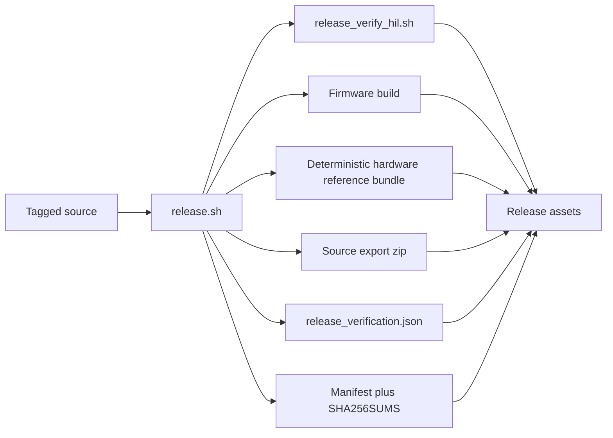

# Reproducibility

This page is the short version of the release artifact story. The detailed, root-level operator document still lives in [`REPRODUCIBILITY.md`](https://github.com/bseverns/MOARkNOBS-42/blob/main/REPRODUCIBILITY.md), but this page keeps the essential flow inside the docs site.

## Why this matters

MOARkNOBS-42 does not just ship binaries. It tries to ship receipts:

- the firmware artifact
- the hardware reference bundle
- a deterministic source export
- a manifest describing how those artifacts were built
- checksums so another machine can verify the output

That matters because this project wants to be teachable and inspectable, not just downloadable.

## Release artifact flow



## Local release command

From the repo root:

```bash
FW_VERSION=vX.Y.Z ./release.sh vX.Y.Z
```

Two things matter there:

- the positional argument names the artifacts
- the `FW_VERSION` environment variable ensures the embedded firmware metadata reports the same version as the tagged release
- HIL execution is recorded in `dist/release_verification.json` (executed, failed, or skipped)

## What the release manifest is for

The generated `dist/manifest.json` is meant to answer:

- what commit was this built from?
- was the tree dirty?
- what PlatformIO/Python environment built it?
- what commands were run?
- what hashes do the resulting artifacts have?
- what verification actually ran vs what was skipped?

Without that manifest, a release is just a pile of files. With it, the release becomes auditable.

## Read the full operator guide

For the full step-by-step release recipe, troubleshooting notes, and artifact details, read the root-level [Reproducibility Playbook](https://github.com/bseverns/MOARkNOBS-42/blob/main/REPRODUCIBILITY.md).
