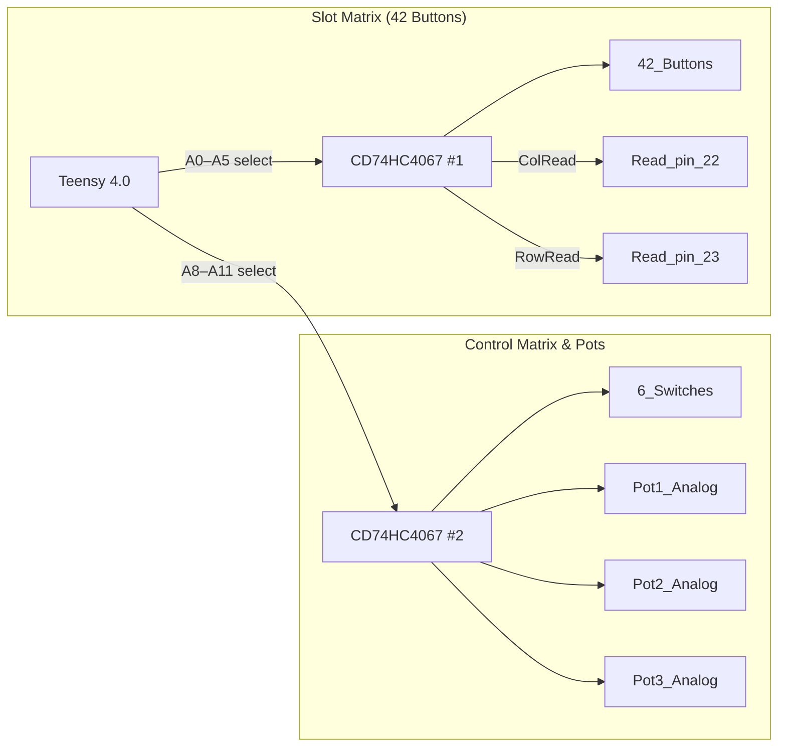

Feast your eyes on the button matrix! A matching screenshot lives in [PNG_btnBRD_2025-07-22](PNG_btnBRD_2025-07-22).

```mermaid
flowchart LR
  subgraph SlotMatrix["Slot Matrix (42 Buttons)"]
    U1[Teensy 4.0] -->|A0–A5 select| CD1[CD74HC4067 #1]
    CD1 --> Buttons42[42_Buttons]
    CD1 -->|ColRead| Read22[Read_pin_22]
    CD1 -->|RowRead| Read23[Read_pin_23]
  end

  subgraph CtrlMatrix["Control Matrix & Pots"]
    U1 -->|A8–A11 select| CD2[CD74HC4067 #2]
    CD2 --> Ctrl6[6_Switches]
    CD2 --> Pot1[Pot1_Analog]
    CD2 --> Pot2[Pot2_Analog]
    CD2 --> Pot3[Pot3_Analog]
  end
```

