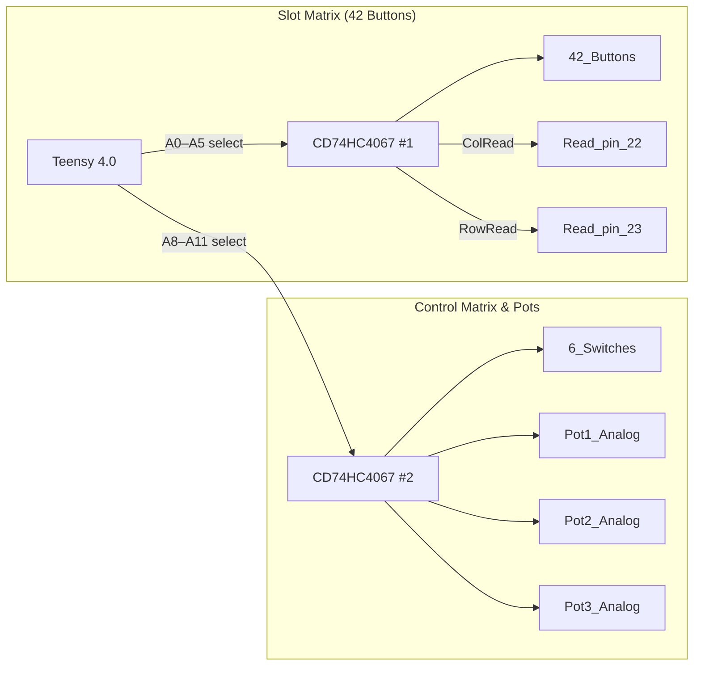

The button slab leans on **two CD74HC4067s** to jam a 7×6 switch matrix into a lone ADC channel.
One mux picks the row, the other picks the column, and the Teensy 4.0 sniffs the junction through
`buttonMuxAnalogPin`—42 switches, one pin, zero shame.

Feast your eyes on the button matrix! A matching screenshot lives in [PNG_btnBRD_2025-07-22](PNG_btnBRD_2025-07-22).

### Scan dance

- **Kick a row live.** Drive `PIN_ROW_DRV` high and set `MUXR1..4` to the row index.
- **Sweep the columns.** For each column, wiggle `MUXC1..4` and let the internal pull‑up duke it out.
- **Sniff the analog line.** Sample `buttonMuxAnalogPin` (A4); low voltage means the switch at that row/column is getting mashed.
- **Drop the row and move on.** Pull `PIN_ROW_DRV` low, bump the row counter, and keep cruising.
- **Repeat fast.** Hit all 7×6 combos before the user blinks and they'll think you're psychic.

