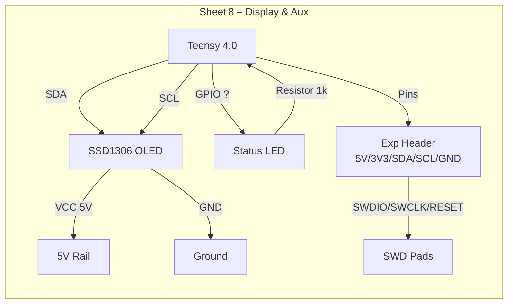

The display block pumps I²C pixels to a tiny SSD1306 OLED and breaks out an aux header for debugging.
Teensy pins 18/19 sling SDA/SCL while a spare GPIO drives the status LED.
The OLED likes 5 V for power but I²C stays at 3 V3—mix them up and you’re in for a long night.

**References**
- [Full schematic](SCH_MOAR_Schematic_2025-08-01.pdf)
- [SSD1306 datasheet](https://cdn-learn.adafruit.com/assets/assets/000/036/495/original/SSD1306.pdf)
- Snapshot [PNG_btnBRD_2025-07-22](PNG_btnBRD_2025-07-22)

Here’s the display & aux header layout. Check the [PNG](PNG_btnBRD_2025-07-22) folder for the original schematic snapshot.

