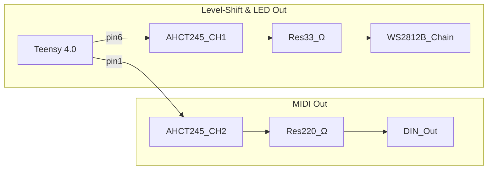

Tiny but mighty LED drivers and MIDI outlines! The related schematic snapshot is in [PNG_btnBRD_2025-07-22](PNG_btnBRD_2025-07-22).

```mermaid
flowchart LR
  subgraph LevelShiftLED["Level-Shift & LED Out"]
    U1[Teensy 4.0] -->|pin6| LS1[AHCT245_CH1]
    LS1 --> R33[Res33_Ω]
    R33 --> LEDStrip[WS2812B_Chain]
  end

  subgraph MIDIOut["MIDI Out"]
    U1 -->|pin1| LS2[AHCT245_CH2]
    LS2 --> R220[Res220_Ω]
    R220 --> DINOut[DIN_Out]
  end
```

