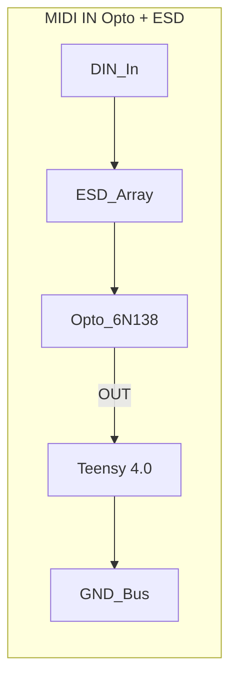

Incoming MIDI gets quarantined here before touching the digital brain.
The DIN jack hits an ESD array then a 6N138 optocoupler, which spits out an isolated logic level for the Teensy.
Beware: 6N138s are slow—keep the pull‑up lean or you’ll drop notes.

**References**
- [Full schematic](SCH_MOAR_Schematic_2025-08-01.pdf)
- [6N138 datasheet](https://www.vishay.com/docs/83726/6n138.pdf)
- Snapshot [PNG_btnBRD_2025-07-22](PNG_btnBRD_2025-07-22)

Optocoupler & ESD stage for incoming MIDI. See the screenshot in [PNG_btnBRD_2025-07-22](PNG_btnBRD_2025-07-22).

