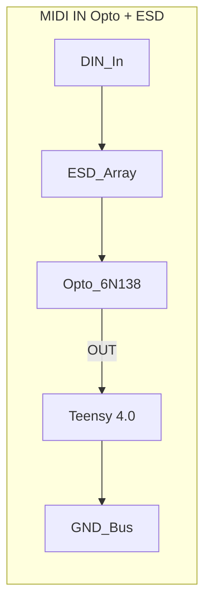

Optocoupler & ESD stage for incoming MIDI. See the screenshot in [PNG_btnBRD_2025-07-22](PNG_btnBRD_2025-07-22).

```mermaid
flowchart LR
  subgraph MIDIIn["MIDI IN Opto + ESD"]
    DINIn[DIN_In] --> ESD[ESD_Array]
    ESD --> Opto[Opto_6N138]
    Opto -->|OUT| U1[Teensy 4.0]
    U1 --> GND[GND_Bus]
  end
```

