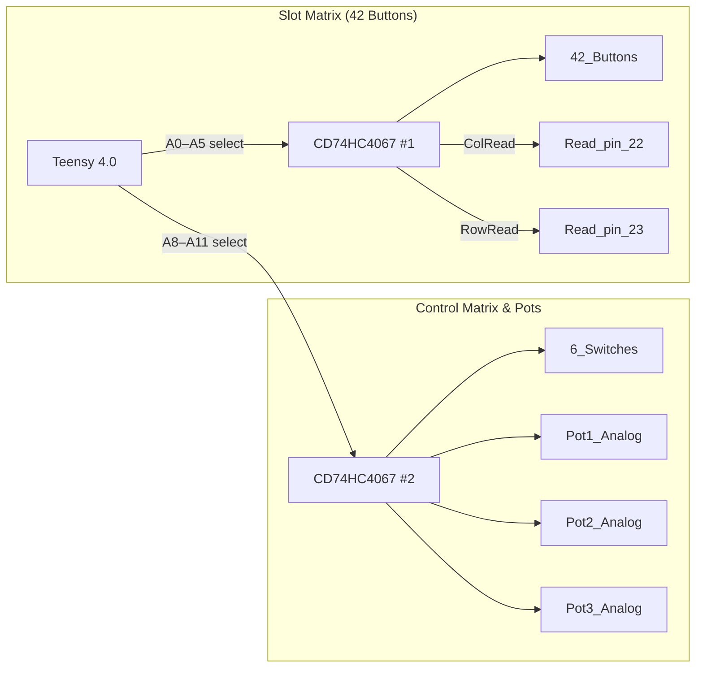

This matrix corrals forty‑two stomp buttons and a handful of extra controls into a duo of CD74HC4067 multiplexers.
The Teensy hurls address lines on A0–A5 (buttons) and A8–A11 (aux stuff) then listens back on pins 22/23 or analog taps.
Keep the wiring tight and the logic at 3 V3 or phantom hits will riot across the board.

**References**

- [Schematic](../../ButtonMatrix.png)
- [CD74HC4067 datasheet](https://www.ti.com/lit/ds/symlink/cd74hc4067.pdf)
- Snapshot [ButtonMatrix.png](../../ButtonMatrix.png)

Feast your eyes on the button matrix! A matching screenshot lives in [ButtonMatrix.png](../../ButtonMatrix.png).

### Scan dance

- **Kick a row live.** Drive `PIN_ROW_DRV` high and set `MUXR1..4` to the row index.
- **Sweep the columns.** For each column, wiggle `MUXC1..4` and let the internal pull‑up duke it out.
- **Sniff the analog line.** Sample `buttonMuxAnalogPin` (A4); low voltage means the switch at that row/column is getting mashed.
- **Drop the row and move on.** Pull `PIN_ROW_DRV` low, bump the row counter, and keep cruising.
- **Repeat fast.** Hit all 7×6 combos before the user blinks and they'll think you're psychic.
