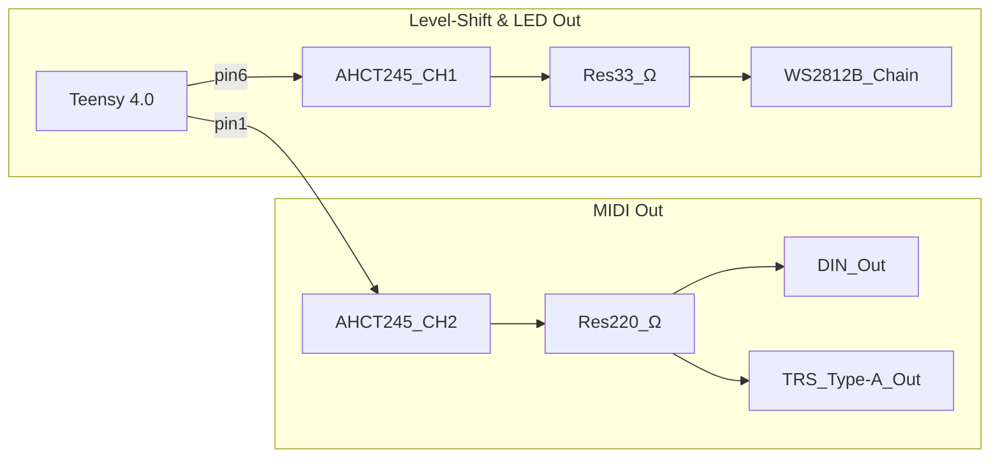

One AHCT245 channel kicks 3 V3 logic up to 5 V for a rowdy WS2812B LED strip, while another shoves MIDI bits out both a DIN jack and a 1/8" TRS Type‑A socket.
Teensy pin 6 drives the LED chain; pin 1 handles MIDI through a 220 Ω resistor.
The AHCT245 wants 5 V on VCC—starve it and your colors go full anarchy.

**References**
- [Full schematic](SCH_MOAR_Schematic_2025-08-01.pdf)
- [74AHCT245 datasheet](https://www.ti.com/lit/ds/symlink/sn74ahct245.pdf)
- [WS2812B datasheet](https://cdn-shop.adafruit.com/datasheets/WS2812B.pdf)
- Snapshot [PNG_btnBRD_2025-07-22](PNG_btnBRD_2025-07-22)

Tiny but mighty LED drivers and MIDI outlines! The related schematic snapshot is in [PNG_btnBRD_2025-07-22](PNG_btnBRD_2025-07-22).

