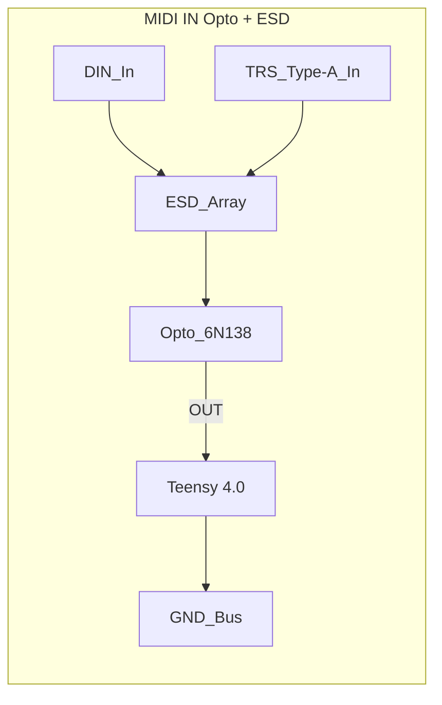

Incoming MIDI gets quarantined here before touching the digital brain.
The DIN jack and its 1/8" TRS sidekick hit an ESD array then a 6N138 optocoupler, which spits out an isolated logic level for the Teensy.
Beware: 6N138s are slow—keep the pull‑up lean or you’ll drop notes.

**References**
- [Schematic](../../MIDI.png)
- [6N138 datasheet](https://www.vishay.com/docs/83726/6n138.pdf)
- Snapshot [MIDI.png](../../MIDI.png)

Optocoupler & ESD stage for incoming MIDI. See the screenshot in [MIDI.png](../../MIDI.png).

