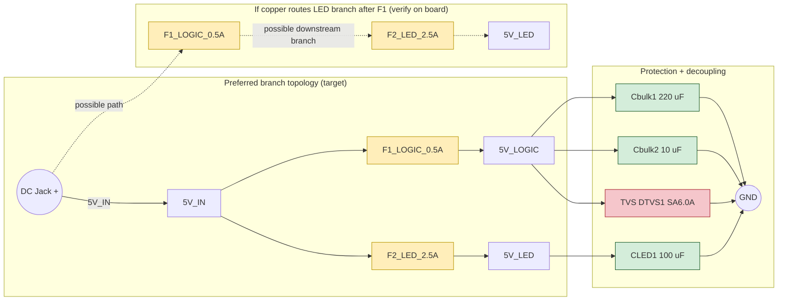

This chunk handles external power entry, fusing, and transient suppression before logic and LEDs wake up.

## External Power Requirement

Use a regulated `5 V DC` input.

- `5 V / 4 A` minimum recommended bench supply
- `5 V / 5 A` preferred for LED-heavy testing and burn-in
- common ground is required across logic, LED, MIDI, and envelope follower sections

> [!WARNING]
> Do not feed `9 V` or `12 V` into VIN unless a regulator/buck stage is intentionally added and documented.
> In this project, `VIN_RAW` / `VIN_FUSED` are internal net labels and should not be read as Arduino-style raw VIN acceptance.

## Topology Intent Versus Risk

Preferred topology:

- `5V_IN -> F1_LOGIC_0.5A -> 5V_LOGIC`
- `5V_IN -> F2_LED_2.5A -> 5V_LED`

Problematic topology:

- `5V_IN -> F1_LOGIC_0.5A -> ... -> F2_LED_2.5A -> 5V_LED`

> [!WARNING]
> If `F1_LOGIC_0.5A` is upstream of the LED branch, that `0.5 A` PTC becomes the effective whole-system current limit. Firmware brightness limits are safety helpers, not replacements for correct hardware power topology.

## Verify Before High-Current LED Tests

Before `white100`, `blast`, or long burn-in runs:

- meter DC jack positive to `F1` input/output
- meter DC jack positive to `F2` input
- determine whether `F1` and `F2` are parallel branches or whether `F2` is downstream of `F1`
- do not run full-strip white or burn-in tests until this is confirmed

## Schematic Verification Status

TODO: check the current schematic and PCB copper directly before claiming the branch topology is correct in release documentation.

## References

- [Schematic](../../Power-Reg.png)
- [SA6.0A TVS datasheet](https://www.littelfuse.com/products/tvs-diodes/standard-tvs-diodes/sa.aspx)
- Snapshot [Power-Reg.png](../../Power-Reg.png)

Power and protection overview. A detailed PNG version lives in [Power-Reg.png](../../Power-Reg.png).

