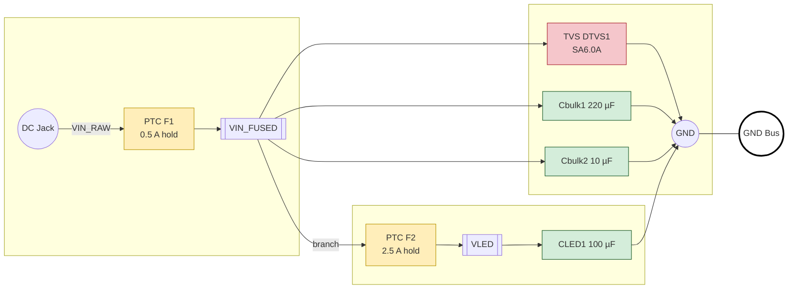

This chunk wrangles incoming power, fuses, and transient smackdowns before the rest of the rig sees a volt.
VIN hits a resettable fuse, bulk caps, and a TVS clamp, then splits off to a beefy LED rail through its own PTC.
PTCs trip slow—short that LED strip and the core might brown out before the fuse wakes up.

**References**

- [Schematic](../../Power-Reg.png)
- [SA6.0A TVS datasheet](https://www.littelfuse.com/products/tvs-diodes/standard-tvs-diodes/sa.aspx)
- Snapshot [Power-Reg.png](../../Power-Reg.png)

Power and protection overview! A detailed PNG version lives in [Power-Reg.png](../../Power-Reg.png).

