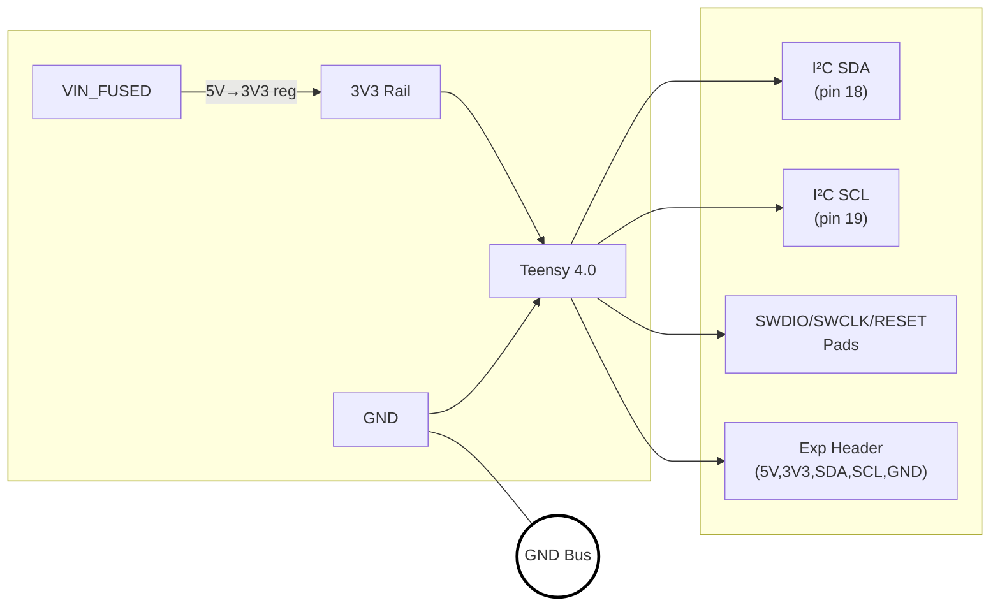

This page maps how the Teensy 4.0 gets its juice and how its pins escape the board.
A 5 V feed hits the onboard regulator for 3 V3, while I²C and SWD signals fan out to headers for hacking.
Never back‑feed the 3 V3 rail through the expander unless you like smoke.

**References**
- [Schematic](../../Interface&Cntrl.png)
- [Teensy 4.0 pinout](https://www.pjrc.com/teensy/pinout.html)
- Snapshot [Interface&Cntrl.png](../../Interface&Cntrl.png)

Teensy power pins and expansion headers. The screenshot version lives in [Interface&Cntrl.png](../../Interface&Cntrl.png).

