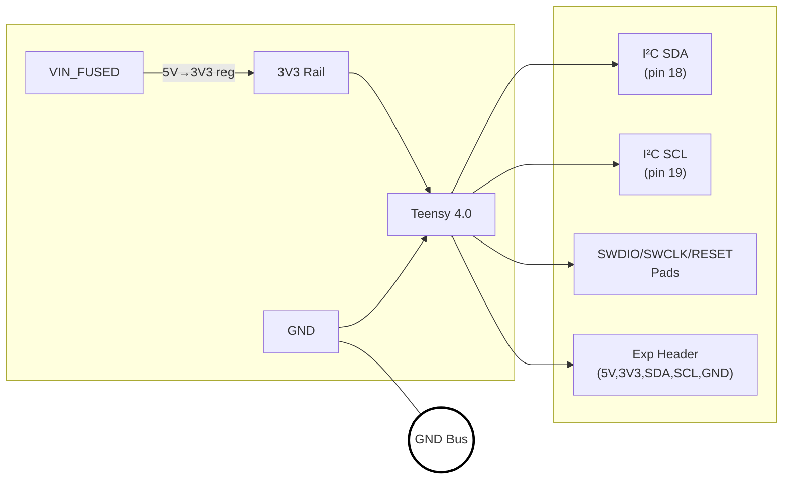

Teensy power pins and expansion headers. The screenshot version lives in [PNG_btnBRD_2025-07-22](PNG_btnBRD_2025-07-22).

```mermaid
flowchart LR
  subgraph TeensyPower[" "]
    VIN_FUSED -->|5V→3V3 reg| VCC3V3[3V3 Rail]
    VCC3V3 --> Teensy[Teensy 4.0]
    GND --> Teensy
  end

  subgraph Headers[" "]
    Teensy --> SDA["I²C SDA<br/>(pin 18)"]
    Teensy --> SCL["I²C SCL<br/>(pin 19)"]
    Teensy --> SWD["SWDIO/SWCLK/RESET<br/>Pads"]
    Teensy --> EXP["Exp Header<br/>(5V,3V3,SDA,SCL,GND)"]
  end

  %% Ground bus  
  classDef groundBus fill:none,stroke:#000,stroke-width:3px;
  GND --- groundBusNode((GND Bus))
  groundBusNode:::groundBus
```
