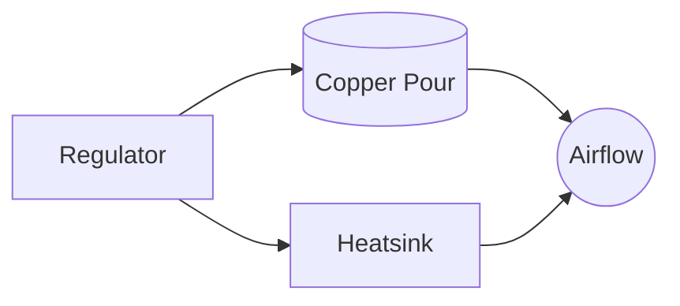

# Thermal Mayhem 101

~~Regulators and LED drivers aren't fans of flash fry.~~ Here's how to keep them from cooking themselves off the board.

Back up one directory to the [docs index](../index.md) for the full paper trail.

## Copper Pours & Heatsinks

- Flood the regulator and LED-driver zones with copper pour. Let the board act as their personal radiator.
- If real estate is tight, bolt on dedicated heatsinks or a chunk of aluminum. Punk DIY heat spreaders work too.

## When It's Still Too Hot

- Step up to larger packages that can shed more heat without whining.
- Split the current across multiple regulators so no single part taps out early.

## Why Bother?

Thermal headroom buys reliability. Cooked regulators mean random resets, brownouts, and all-night debugging sessions you didn't sign up for.

Stay cool, literally.
