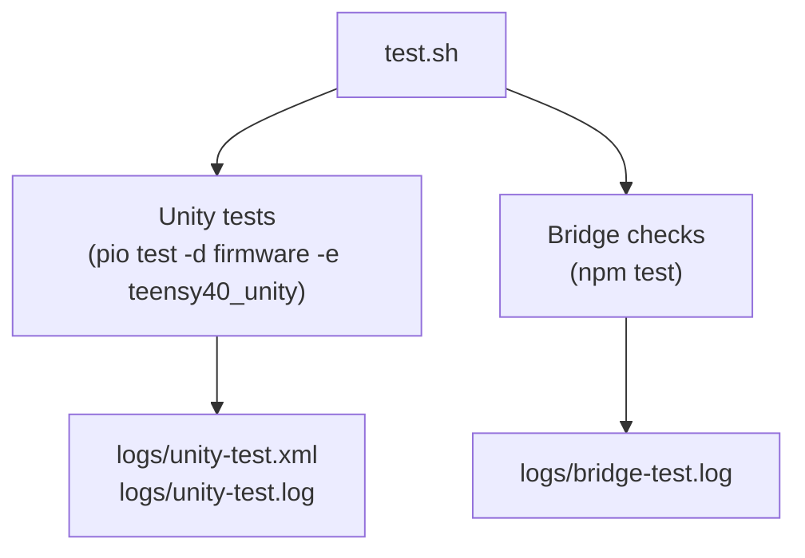

# Testing the Beast

This repo runs tests in layers, from polite unit checks to full-on hardware cage matches. Every layer has a job: make sure the firmware math is sane, prove the bridge still talks, and keep you from hauling a broken controller to a gig. Read this as a teaching map, not just a checklist—if you know why a test exists, you know when to lean on it.

Unless a section says otherwise, commands below assume you are running from the repo root.

## Layer cheat sheet

| Layer                    | Command                                                                                                           | Hardware needed                             | What it proves                                                                                                             |
| ------------------------ | ----------------------------------------------------------------------------------------------------------------- | ------------------------------------------- | -------------------------------------------------------------------------------------------------------------------------- |
| Full battery             | `./test.sh`                                                                                                       | Teensy 4.0 for Unity, host machine for Node | Runs everything below, writes clean logs, perfect for CI and pre-commit rituals.                                           |
| Unity smoke tests        | `pio test -d firmware -e teensy40_unity`                                                                          | Teensy 4.0 with USB cable                   | Exercises firmware logic and orchestration paths with the custom Unity harness over Serial1.                               |
| App seam regressions     | `npm --prefix App test`                                                                                           | Host machine only                           | Proves simulator UX, native transport adaptation, capability gating, and browser-local metadata behavior without hardware. |
| Manual firmware sketches | `pio run -d firmware -e teensy40_unified_test -t upload` (and friends)                                            | Fully assembled controller                  | Human-driven end-to-end testing of LEDs, pots, EEPROM, etc.                                                                |
| Bridge CLI sanity        | `npm --prefix bridge test`                                                                                        | Host machine only (Node 24)                 | Keeps the OSC bridge CLI parsing and error handling sharp.                                                                 |
| System bridge trials     | `node firmware/system_test/mn42_fullstack_runner.js` or `node firmware/system_test/mn42_bridge_session_runner.js` | Controller + bridge talking                 | Legacy OSC/MIDI heartbeat proof plus the newer structured bridge-session HIL proof for staged apply/ACK on real hardware.  |

## If your goal is demo readiness rather than code confidence

Use these docs alongside the command layers above:

- [ValidationFlow.md](ValidationFlow.md) for the go/no-go path from bring-up to demo-ready
- [DemoTestPunchList.md](DemoTestPunchList.md) for the operator pass on the actual prototype or rehearsal setup

## Bench matrix

When the goal is to find physical limits rather than just software regressions, run the bench in layers and record receipts instead of vibes.

| Stage                   | Command                                                        | Main observation target                                             | Capture                       |
| ----------------------- | -------------------------------------------------------------- | ------------------------------------------------------------------- | ----------------------------- |
| Firmware baseline       | `pio run -d firmware -e teensy40_main`                         | Build sanity before bench time                                      | Build result                  |
| Logic sanity            | `pio test -d firmware -e teensy40_unity`                       | Core firmware behavior before touching hardware limits              | Unity log                     |
| Manual board check      | `pio run -d firmware -e teensy40_unified_test -t upload`       | Buttons, pots, OLED, LED chain basic health                         | Operator notes                |
| LED surface stress      | `pio run -d firmware -e teensy40_led_demo -t upload`           | Pixel integrity, animation throughput, brownouts under dynamic load | Serial log + visual notes     |
| Power / thermal burn-in | `pio run -d firmware -e teensy40_power_burnin -t upload`       | Rail sag, white-load current, thermal rise, long-run stability      | Serial log + PSU/thermal data |
| Persistence abuse       | `pio run -d firmware -e teensy40_eeprom_persistence -t upload` | Save/load and reboot resilience                                     | Serial log                    |
| Storage verification    | `pio run -d firmware -e teensy40_slot_verify -t upload`        | Slot data integrity                                                 | Serial log                    |

Use the burn-in harness when you want the board to sit in one high-load state for minutes or hours. It cycles through `white25`, `white50`, `white100`, `red`, `green`, `blue`, `sweep`, `wash`, and `blast`, and it logs:

- observed `vref`, `vrefMin`, and `vrefMax`
- `fps`, `writesPerSec`, and `passesPerSec`
- peak observed rates over a short sampling window
- brownout count and current phase lock state

> [!WARNING] > `white100` and `blast` are deliberate stress phases, not normal operating visuals.
> Full white on 52 WS2812 LEDs can exceed `3 A`, and full-strip primaries can still exceed a `0.5 A` upstream fuse.
> Run those phases only with a regulated `5 V` supply and confirmed LED rail topology.

The serial monitor also accepts:

```text
phase idle
phase white100
phase sweep
phase wash
phase blast
phase auto
status
help
```

Recommended bench captures for `teensy40_power_burnin`:

- bench PSU voltage/current at each white-load phase
- 3V3 rail and LED rail sag during `white100` and `blast`
- thermal readings at the regulator, MCU, and LED power injection points
- whether any LED corruption, USB disconnect, or spontaneous reset appears

For long runs, capture the serial stream into both raw text and CSV:

```bash
python3 tools/capture_bench_log.py --label burnin
```

The helper auto-detects a likely serial port, mirrors live output to the terminal, writes a raw `.log`, and extracts structured `[HEALTH]` / `[BURN]` lines into a CSV under `logs/`. It requires `pyserial` on the host:

```bash
python3 -m pip install pyserial
```

Useful variants:

```bash
python3 tools/capture_bench_log.py --port /dev/cu.usbmodem1234561 --label white100
python3 tools/capture_bench_log.py --label soak --duration 3600
python3 tools/capture_bench_log.py --label blast --no-echo
```

Then summarize the CSV into a compact bench report:

```bash
python3 tools/summarize_bench_log.py logs/burnin-20260414-120000.csv
python3 tools/summarize_bench_log.py logs/burnin-20260414-120000.csv --format markdown --output logs/burnin-summary.md
```

If you want one command to upload, phase-lock, capture, and summarize a common stress case, use:

```bash
tools/run_bench_capture.sh blast
tools/run_bench_capture.sh white100 --duration 900
tools/run_bench_capture.sh overnight-soak --port /dev/cu.usbmodem1234561 --no-echo
```

## Coverage map

This is the practical answer to "what is actually tested?" for the current stack.

| Surface                                                                                       | Automated status         | Primary layer                           | Notes                                                                                                                                                                                                                                                            |
| --------------------------------------------------------------------------------------------- | ------------------------ | --------------------------------------- | ---------------------------------------------------------------------------------------------------------------------------------------------------------------------------------------------------------------------------------------------------------------- |
| MIDI slot/config logic, filters, ARG math, LFOs, arpeggiator rules                            | Strong                   | Unity                                   | Core firmware logic is covered by the long-running `firmware/test/test_*.cpp` suite.                                                                                                                                                                             |
| Command dispatch and serial queue behavior                                                    | Strong                   | Unity                                   | `dispatchCommand`, command parsing, queue overflow, and command buffer flushing are covered.                                                                                                                                                                     |
| Internal interop and keepalive orchestration                                                  | Strong                   | Unity                                   | Handshake/ack/timeout-style paths are covered without needing a live host bridge for every edit.                                                                                                                                                                 |
| Scheduler wiring and recurring task registration                                              | Covered                  | Unity                                   | The current suite now asserts task counts, intervals, and repeat flags so scheduler regressions get caught early.                                                                                                                                                |
| Runtime orchestration                                                                         | Covered                  | Unity                                   | Pending note-offs, diagnostic counter reporting, and related runtime state transitions are asserted directly.                                                                                                                                                    |
| WebSerial payload generation                                                                  | Covered                  | Unity                                   | Snapshot and slot-patch JSON are checked as emitted payloads, not just by indirect UI behavior.                                                                                                                                                                  |
| UI tuning helpers                                                                             | Covered                  | Unity                                   | Note dynamics, arp tuning, filter tuning, and streamed active-slot context are now exercised directly.                                                                                                                                                           |
| Browser configurator transport + capability gating                                            | Covered                  | App Playwright                          | Simulator UX, native `HELLO/GET_*/SET_ALL` adaptation, device-backed profile/macro/scene command mapping, older-firmware capability gating, and browser-local slot metadata are covered without hardware.                                                        |
| Bridge CLI parsing/error handling                                                             | Covered                  | Node tests                              | Host-side sanity only; this does not prove live firmware transport timing.                                                                                                                                                                                       |
| Full OSC/MIDI host-control ↔ firmware loop                                                   | Partial automated        | System runner                           | Requires real hardware plus the bridge process. Good release gate, not the fastest inner-loop test.                                                                                                                                                              |
| Profile/macro/scene recovery flows on real hardware                                           | Scripted, bench required | System runner with `--exercise-storage` | Uses direct serial commands after the bridge pass to prove EEPROM-backed save/load/reset and snapshot recall. Intentionally destructive unless you point it at sacrificial slots.                                                                                |
| `firmware_main.cpp` boot composition and final hardware bring-up                              | Scripted, bench required | `mn42_boot_contract_runner.js`          | Direct serial proof now covers the cold-boot standalone marker lane plus an attach-live fallback for `HELLO` -> `ENTER_CONFIG_MODE` -> configurator handshake -> real `SET_ALL` ACK/readback on `teensy40_main`. Unity still does not prove that path by itself. |
| OLED rendering, LED electrical behavior, mux noise, pot feel, EEPROM behavior on a real board | Manual only              | Manual sketches / bench testing         | These need a physical controller and human observation.                                                                                                                                                                                                          |

The important distinction: the Unity layer is now broad enough to catch most firmware logic drift, including several orchestration paths that used to be untested, but it still cannot certify the real board by itself.

## Bench RTL via DAW loop

When you need proof that the full rig (controller → interface → DAW → interface
→ controller) behaves under pressure, run the Oblique RTL method alongside the
regular firmware tests:

```bash
python tools/rtl_latency_report.py \
  --baseline docs/bench/latency/raw/rtl_baseline_run*.wav \
  --tuned docs/bench/latency/raw/rtl_tuned_run*.wav \
  --buffers baseline=256 tuned=64
```

Stash the resulting table in your lab notes and commit the JSON if you pass
`--json`. The script flags the latency in samples, milliseconds, and buffer
counts so you can spot regressions between firmware changes.

## Preflight kit

Before you run anything, make sure you actually have the tools:

- **PlatformIO Core 6+** in your `$PATH`. We call `pio` directly.
- **Node.js 24** plus npm for the bridge sanity checks.
- **A Teensy 4.0 wired up** with a USB cable that actually carries data.
- **Dialed-in udev/serial permissions** so `/dev/ttyACM*` or `/dev/cu.usbmodem*` is readable.
- **A `logs/` directory**—`test.sh` creates it, but manual runs should too if you want artifacts.
- Optional but smart: put the controller on a powered hub so repeated flashes don’t brown it out.

## Quick hit: `test.sh`

If you want everything in one punch, run the orchestrator from the repo root:

```bash
./test.sh
```

### What it orchestrates

- Sweeps the build tree (`pio run -d firmware -t clean`) so Unity tests start fresh.
- Attempts to auto-detect a Teensy serial port, unless you yell one through `TEST_PORT`.
- Runs the Unity suite **without re-uploading firmware** (`--without-uploading`). That means you should have flashed `teensy40_unity` at least once beforehand, or the board will still be running whatever you last put on it.
- Greps the Unity output to make sure PlatformIO didn’t sneak in its own transport shim.
- Launches the Node-based bridge tests via `npm --prefix bridge test`.

### Dependencies

- PlatformIO must be installed with the Teensy platform and custom Unity runner available. The script bails on missing executables.
- `bridge/node_modules` should exist. If not, run `npm install` in `bridge/` once before relying on the script.
- `App/node_modules` should exist if you want the browser seam tests too. Run `npm install` in `App/` once before relying on the full app suite.
- Teensy board with the Unity test firmware already on it if you expect hardware tests to actually run; otherwise the script will log that Unity was skipped.

### Port juggling

The script looks for the first match among `/dev/ttyACM*`, `/dev/ttyUSB*`, `/dev/cu.usbmodem*`, and `/dev/cu.usbserial*`. Override it if you have multiple boards plugged in:

```bash
TEST_PORT=/dev/ttyACM1 ./test.sh
```

You can also export `TEST_PORT` once in your shell profile if that board never moves.

### Log haul

After a successful swing you’ll have:

- `logs/unity-test.log` – raw Unity chatter. Look for `[==========]` headers and a final `OK`.
- `logs/unity-test.xml` – JUnit XML, perfect for CI badge voodoo.
- `logs/bridge-test.log` – npm’s test output, including stderr if the bridge freaks out.

### When things explode

- **“Skipping Unity tests”** – no Teensy port was found. Flash the board, double-check cables, or pass `TEST_PORT` explicitly.
- **“Autogen Unity transport detected”** – PlatformIO regenerated its default Unity transport. Clean your `.pio` tree (`pio run -d firmware -t clean`) and make sure you didn’t delete `firmware/test/unity_output.cpp` or `firmware/test/unittest_transport.cpp`.
- **Unity timeouts** – usually the board wasn’t flashed with the Unity firmware. Run `pio test -d firmware -e teensy40_unity` without `--without-uploading` once to seed it.
- **Bridge test failures** – run `npm --prefix bridge test -- --watch` locally and fix whatever CLI regression the suite is screaming about.



_Alt text: Flowchart of `test.sh` hammering Unity firmware tests and bridge JS checks, each spraying their own log files._

## Unity smoke tests (`firmware/test/`)

Unity tests are the quick-and-dirty pulse check for the firmware. They run on the Teensy board and stub out anything that would otherwise demand real wires. Fire them up when you’ve tweaked core logic or want receipts before you solder.

What Unity is especially good at right now:

- deterministic firmware logic
- command/protocol behavior
- scheduler/runtime/WebSerial/UI orchestration
- regression checks that should fail before you ever reach for a bench supply

What Unity is not meant to prove:

- the exact `firmware_main.cpp` production boot path
- OLED/LED behavior on real hardware
- mux settling, analog noise, and other physical quirks
- end-to-end "performer touched the board and the whole rig responded" behavior

### First-time setup

1. Plug the Teensy in and make sure `pio device list` shows the port you expect.
2. Seed the board with the Unity runner so `test.sh` has something to talk to:
   ```bash
   pio test -d firmware -e teensy40_unity
   ```
   This compiles, uploads, and executes the suite in one shot. You’ll see Unity scroll by in your terminal. Subsequent invocations via `test.sh` can skip uploading.

The `teensy40_unity` environment speaks over `Serial1` at 115200 baud and leans on the custom `unity_output.cpp` + `unity_config.h` duo in `firmware/test/`. If you need to route output elsewhere (e.g., different UART pins), edit those files—not the PlatformIO defaults.

One practical note: `pio test -d firmware -e teensy40_unity --without-uploading` still expects a flashed board to be present for execution. It is useful when you want fresh test output without reflashing, but it is not the same thing as a hardware-free test run.

### Running by hand after setup

Once the firmware is already flashed, you can grab fresh logs without re-uploading:

```bash
pio test -d firmware -e teensy40_unity --without-uploading --test-port /dev/ttyACM0 -vvv --junit-output logs/unity-test.xml | tee logs/unity-test.log
```

### Reading the results

- Passing runs finish with `OK` and per-test `PASS` tags.
- Failures leave a final summary line like `Errors: 1 Failures: 0 Ignored: 0`. Scroll up to the preceding stack trace for context.
- If the runner hangs, unplug/replug the Teensy and re-run with `-vvv` for extra chatter.

### Narrowing focus

The Unity harness pulls in everything under `firmware/test/test_*.cpp`. To isolate a single test:

1. Edit `firmware/test/test_mainUnity.cpp` and comment out the `RUN_TEST` macros you don’t need.
2. Re-run `pio test -d firmware -e teensy40_unity`.
3. Restore the macros before you commit so CI sees the full suite.

For a deep dive into what each Unity or manual sketch checks, crack open [firmware/test/README.md](https://github.com/bseverns/MOARkNOBS-42/blob/main/firmware/test/README.md). It catalogs every test file with the subsystem it pokes.

### Manual hardware rituals (`src/*_t.cpp`)

Unity can only fake so much. When you need to watch real LEDs blink or feel a pot fight back, flash one of the manual sketches:

| Sketch                         | PlatformIO env                | What you verify                                                                 |
| ------------------------------ | ----------------------------- | ------------------------------------------------------------------------------- |
| `src/main_t.cpp`               | `teensy40_full_system`        | Step through LEDs, buttons, envelope followers, OLED—all with keyboard prompts. |
| `src/unified_t.cpp`            | `teensy40_unified_test`       | Full integration test controlled entirely by the real button matrix.            |
| `src/biquadfilter_t.cpp`       | `teensy40_biquad_test`        | Pure DSP math, no external hardware.                                            |
| `src/eeprom_persistence_t.cpp` | `teensy40_eeprom_persistence` | Ensures EEPROM writes survive reboots.                                          |
| `src/verify_slots_t.cpp`       | `teensy40_slot_verify`        | Pounds on MIDISlot storage and reads it back.                                   |

Run them with `pio run -d firmware -e <env> -t upload`, then open a serial monitor or watch the device directly. These tests need a human watching and pushing buttons; log what you see if something twitches.

## Bridge CLI sanity (`bridge/test/`)

The bridge is the glue between the controller and the outside world. Its tests keep the CLI parser and error handling ruthless.

### Setup

```bash
cd bridge
npm install
```

Do this once per machine so `npm test` has everything it needs.

### Run the suite

```bash
npm test
```

The tests intentionally mock a missing serial port to prove the CLI doesn’t explode when the controller isn’t connected. When they pass, you’ll see Jest exit cleanly with green checkmarks. Failures print stack traces in the terminal and bubble all the way up to `test.sh`.

Want to iterate quickly? `npm test -- --watch` reruns on file changes.

## App seam tests (`App/tests/`)

These are the fastest proof that the browser app still tells the truth about the firmware contract.

### Run the suite

```bash
npm --prefix App test
```

What this currently proves:

- simulator-driven config, profile, and import/export UX
- native transport adaptation (`HELLO`, `GET_MANIFEST`, `GET_CONFIG`, `SET_ALL`)
- capability-aware profile/macro/scene controls on real-firmware manifests
- browser-local slot metadata staying out of `Apply` and surviving reconnects

What it does not prove:

- a real USB board accepted the session
- bridge timing on the demo host
- any hardware-only storage or recovery path

## Real hardware gauntlet (`bridge/` + `firmware/system_test/`)

When you need to prove the whole stack plays nice, you move up to the full-system runner. It expects real hardware **and** the Node bridge to be awake, then drives the host-control path the docs keep promising.

### Scripted flow (no more "coming soon")

1. Flash the Teensy with the full-system firmware so the bridge sees every subsystem:

   ```bash
   pio run -d firmware -e teensy40_full_system -t upload
   ```

2. Install bridge dependencies if you haven't already:

   ```bash
   npm --prefix bridge ci
   ```

3. Kick off the orchestrator from the repo root. It spawns the bridge, waits for the firmware handshake, slings an OSC command, and watches the telemetry stream before shutting everything down again:

   ```bash
   node firmware/system_test/mn42_fullstack_runner.js \
     --serial /dev/ttyACM0 \
     --report logs/system-test.json | tee logs/system-test.log
   ```

   Override serial or OSC ports with flags/env vars when your bench rig isn’t on the defaults. The command exits non-zero when any scenario flakes and writes both JSON + text logs so CI (or your lab notebook) can archive the receipts.

4. When you want the destructive storage smoke pass too, re-run with sacrificial slots:

   ```bash
   node firmware/system_test/mn42_fullstack_runner.js \
     --serial /dev/ttyACM0 \
     --exercise-storage \
     --profile-slot 3 \
     --scene-slot 5 \
     --pot-index 0 \
     --report logs/system-test-storage.json | tee logs/system-test-storage.log
   ```

   This path overwrites the selected profile slot, the single macro snapshot, and the selected scene slot. Use slots you are willing to burn, or restore them afterward as part of the bench ritual.

### Environment expectations

- `teensy40_full_system` – firmware build that exposes every subsystem and respects the USB MIDI + Serial combo used in production.
- Node 24 with the bridge binaries installed. The runner shells out to `node bridge/mn42_bridge.js`, so make sure that CLI can reach your Teensy on `/dev/ttyACM0` (or whatever `TEST_PORT` points at).
- Real hardware: buttons, LEDs, pots, and EEPROM all get exercised. If the runner times out, fall back to the legacy `test_*.cpp` sketches in the same directory to troubleshoot individual subsystems before re-running the automation.

Run the full-system layer before releases or any time hardware or bridge changes. It’s the last line of defense before you haul gear on stage. Bring a board, a cable, and zero fear. These tests waggle LEDs, trash EEPROM, and generally behave like they own the place—and now they leave a neat paper trail in `logs/system-test.*` every time they do it.
