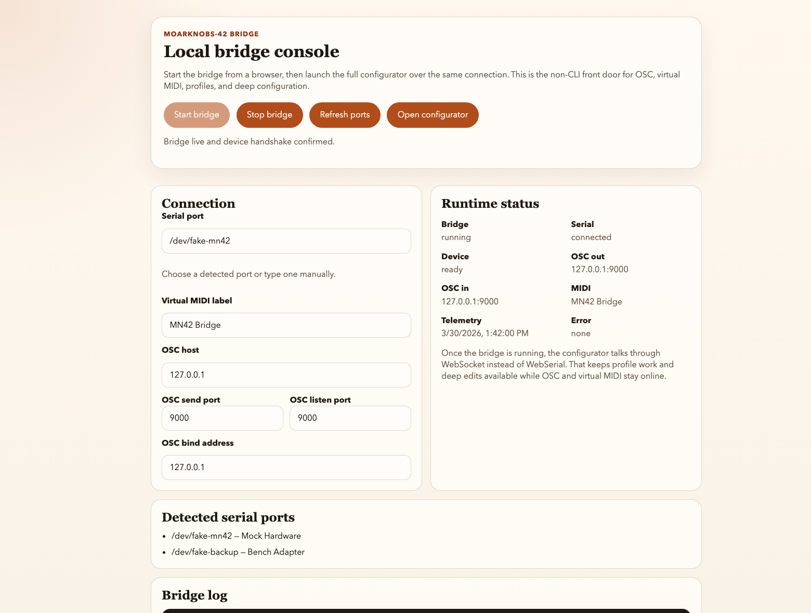

# Validation Flow

Use this page when you need a repeatable answer to one question:

Is this board merely powered on, actually validated, demo-ready, or ready for a broader supported release?

This flow is conservative on purpose. If a step is not proven, mark it as unverified instead of assuming it is fine.


## 1. Pick the validation target

Choose one target before you start:

- `bring-up` for a newly assembled or newly received board
- `demo` for a rehearsal or public-facing prototype pass
- `release-readiness` for broader support or small-batch product claims

## 2. Start with the software gate

Run the automated checks that do not require the finished prototype first.

From the repo root:

```bash
pio test -d firmware -e teensy40_unity -vvv
npm --prefix App test
npm --prefix bridge test
python3 tools/check_markdown_links.py
python3 tools/check_wiki_contract.py
python3 tools/check_contract_sync.py
```

If these fail, fix them before using board time to chase symptoms that may already be explained by a known software regression. `check_contract_sync.py` is now a real host-contract gate: it checks manifest fallbacks and the shared App/firmware schema semantics that staged config, Bridge validation, and direct-WebSerial editing rely on.

## 3. Confirm the board can boot and identify itself

Minimum gate:

1. Power the board over USB.
2. Confirm it enumerates.
3. Send `HELLO`.
4. Confirm the reply is `{"hello":"mn42"}`.
5. Confirm the configurator or bridge can identify the device.

Outcome:

- If this fails, stop and use [Troubleshooting](Troubleshooting.md).
- If this passes, the board is at least in `bring-up started` state.

## 4. Confirm the primary interaction path

Choose the path you actually intend to use.

### Configurator path

Use this when the board will be edited or monitored directly over USB.

Required proof:

- configurator connects
- manifest/config load succeeds
- one staged edit applies cleanly
- on current firmware, one device-backed profile save/load cycle succeeds
- if those controls are disabled, treat it as stale firmware, a failed handshake, or an offline device and use download/upload as the fallback backup path

### Bridge path

Use this when the board will be used with OSC or a DAW-facing MIDI workflow.

Required proof:

- bridge starts
- bridge console connects to the board
- configurator works through the bridge path if that workflow is intended
- at least one real OSC or virtual MIDI command reaches the board through the live-control command path



Outcome:

- If the intended path is not proven, the board is not demo-ready.

## 5. Confirm basic bench behavior

Required proof:

- buttons respond
- LEDs respond
- pots or control inputs produce live changes
- profile baseline can be restored

Optional but recommended for a release-facing claim:

- external clock behavior
- envelope follower behavior with real signal
- repeated USB reconnect
- save/load after power cycle

Outcome:

- If only the minimum set passes, the unit is `basic bring-up validated`.
- If the intended musical/demo behaviors pass too, move to the next gate.

## 6. Run the stress and recovery gate

Use [Demo Test Punch List](DemoTestPunchList.md) for the exact operator pass.

Required proof:

- at least one multi-minute connected session without transport instability
- no stuck-note or stuck-state failure during the intended workflow
- one deliberate recovery action works:
  - reconnect
  - reload profile through the device-backed path
  - file import/export restore if you are validating an older firmware build that does not advertise browser profile actions
  - panic/reset path

Outcome:

- If this fails, the board may still be useful for bench work, but it is not demo-ready.

## 7. Assign the board status

Use one of these statuses in notes, issues, or release prep:

| Status                        | Meaning                                                                                                                                       |
| ----------------------------- | --------------------------------------------------------------------------------------------------------------------------------------------- |
| `received / unvalidated`      | Board exists but has not passed the handshake gate.                                                                                           |
| `bring-up validated`          | Boot, handshake, and basic controls are proven.                                                                                               |
| `demo-ready`                  | Intended workflow, stress pass, and recovery path are proven on the actual setup.                                                             |
| `release-readiness candidate` | Demo-ready plus repeatable manufacturing/support evidence is being assembled.                                                                 |
| `release-ready`               | Reserved status. Do not use it until the manufacturing package, bench evidence, and support boundaries are explicitly signed off in the repo. |

## 8. Decide the next action

Use this rule:

- If boot/handshake fails: fix hardware or flash path first.
- If configurator or bridge fails: fix connectivity before deeper musical testing.
- If musical/demo behavior fails: keep the board in bench status and do not overstate readiness.
- If everything needed for the target passes: record evidence immediately and freeze the working demo setup.

## 9. Evidence to keep

Minimum evidence:

- board identifier or build label
- firmware commit or release tag
- host OS and browser/bridge path used
- profile slot used for the baseline state
- pass/fail notes for each gate

Recommended evidence:

- short demo video
- screenshot of the configurator or bridge console while connected
- note of any `UNVERIFIED` behavior you intentionally did not claim

## 10. What this flow does not prove

This flow does not, by itself, prove:

- long-term hardware reliability
- substitute-part equivalence
- repeatable fabrication readiness
- customer-support readiness across all host setups

Those are separate release/support questions. Use this flow to keep prototype, demo, and release language honest.
