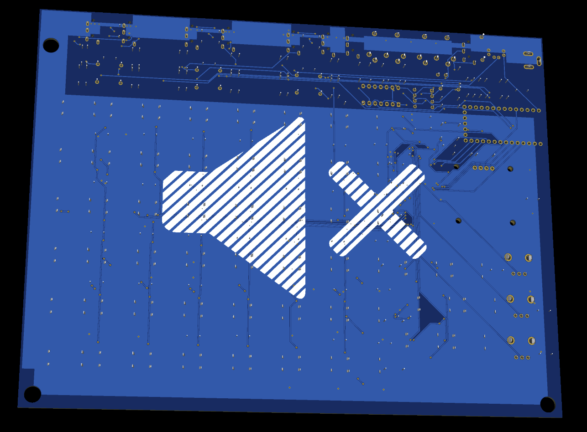
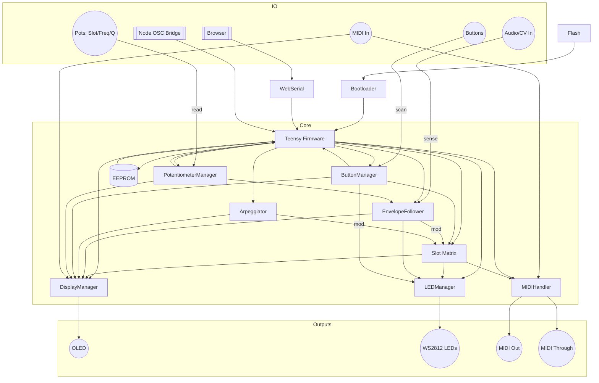

# MOARkNOBZ MN42 MIDI Controller

> Firmware for the unapologetically DIY, button-stabbin', knob-hackin', MIDI-mashin' controller you didn’t ask for but definitely need.

## What's This?

The **MOARkNOBZ MN42** is not your average MIDI controller. This thing used to rock 42 real pots, but now it gets the job done with 3 control pots—one slot value pot and a pair for filter tuning—a bunch of buttons, and enough virtual slots to make your DAW weep.

Forget fragile GUIs and boutique workflows. This beast lives in the guts: built on a Teensy 4.0 MCU, button-bounced, EEPROM-backed, LED-synced firmware for live tweaking, studio sculpting, or performance chaos.

And driving the chaos? Your own automation parameters or six real-time **envelope followers**, each capable of modulating any control slot based on live input audio or CV (+5V). These EFs don't just track amplitude—they shape it through selectable filters, turning your input into living modulation.

Need the topographic map of all this chaos? Hit up the [systemflow docs](../docs/sketch/systemFlow/hw/) to see how the firmware wires into every slab of hardware.

## Quickstart: Jam Now, Explain Later

1. **Power and Plug In** – External power wakes the brain and both DIN/TRS jacks spit MIDI immediately. To light up USB MIDI, smash `Ctrl3`+`Ctrl4`+`Ctrl5`.
2. **Pick a Slot** – Twist the lone slot pot or tap a slot button. Each of the 42 slots remembers its own channel, CC/note/program, and EF hookup.
3. **Map It** – Use the [WebSerial editor](App/benzknobz.html) or `SET_POT` over a serial terminal to bind that slot to whatever your synth expects. Need button combos? See the [button map](include/ButtonManager/README.md#button-map).
4. **Modulate** – Pair any slot with one of six envelope followers. `Freq` and `Q` pots sculpt the follower's filter shape in real time. Filter types live [here](include/EnvelopeFollower/README.md#filter-types).
5. **Save & Play** – Settings persist in EEPROM, so once it's dialed, yank the cable and go.

Crave more tweakables? Scope the [MIDI message list](include/MIDIHandler/README.md#supported-message-types), [ARP tricks](include/Arpeggiator/README.md#arp-settings), or dive headfirst into [WebSerial dark magic](../docs/WebSerial.md).

## Directory Layout

- **src/** – core firmware sources.
- **include/** – headers and module docs.
- **system_test** - helpers and snippets for full rig tests.
- **test/** – manual and Unity-driven hardware checks.
- **App/** – WebSerial config page.
- **lib/** – vendored Arduino libs that keep the lights on.

## Reference Tables

- [Button map](include/ButtonManager/README.md#button-map)
- [Envelope filter types](include/EnvelopeFollower/README.md#filter-types)
- [Arp settings](include/Arpeggiator/README.md#arp-settings)
- [MIDI message types](include/MIDIHandler/README.md#supported-message-types)
- [ARG methods](include/EnvelopeFollower/README.md#arg-methods)
- [Display hooks](include/DisplayManager/README.md#key-methods)

## Key Features

- **42 Virtual MIDI Slots**: Store independent CC/channel pairs, slot types, and EF settings.
- **Supports Multiple MIDI Types**: CC, Note, Program Change, Aftertouch, Pitch Bend, Mod Wheel, NRPN, RPN, and SysEx.
- **Dynamic Envelope Modulation**: Shape CCs using audio input across 6 analog channels.
- **ARG Mode**: Blend/compare signals using programmable logic for creative chaos.
- **Arpeggiator Mode**: Repeats any MIDI slot type in tempo; filter pots set length and pattern.
- **Note Dynamics Knobs**: When the arp is idle, “Freq” shoves outgoing velocity (‑64…+63) and “Q” rigs the odds a pot twist actually fires a new note.
- **Perlin-Spiced Randomness**: The "random" shape rides a lightweight Perlin noise function, giving chaos more of a groove.
- **Per-EF Filter Selection & Real-Time Tuning**: Each envelope follower can be set to linear, opposite, exponential, random, low-pass, high-pass, or band-pass response. Two dedicated pots allow on-the-fly tuning of filter cutoff (frequency) and resonance (Q).
- **EEPROM Resilience**: Built-in config backup system with a `CONFIG_VERSION` tag and a CRC sniff-test. If the bytes smell wrong, the firmware torches the lot and boots clean.
- **JSON System Report**: `sys::printReport()` spills firmware version and commit hash in one tidy blob.
- **Rollover-Proof Matrix Scan**: Diode-backed rows plus debounced reads keep ghosting and dropped presses from crashing the party.
  - **Dual MIDI Output**: 5‑pin DIN and 1/8" Type‑A jacks scream from boot. USB MIDI stays dark until you mash **Ctrl3+Ctrl4+Ctrl5**.
- **Idle Screensaver**: OLED enters low-power animations after inactivity.
- **Extensible Codebase**: Modular OOP C++ with task scheduler and serial debugging.
- **HTML-Based Editor**: View and update settings via WebSerial (USB) — assign EFs, pick ARG methods, splash LED colours, and fall back to a local `config_schema.json` when the device ghosts you.
  _Note:_ The app fetches its schema from the device; if the device stays silent, it uses the bundled `config_schema.json`.
- **WebSerial Telemetry**: Streams slot values and envelope levels so you can watch every tweak in a browser. See [../docs/WebSerial.md](../docs/WebSerial.md).

### Dynamic Envelope Modulation

Those six envelope followers aren't just spectators—they hijack whatever slot you point them at. Wire an EF to a slot, pick a curve (linear, inverse, exponential, random, or the filter trio), and the `Freq`/`Q` pots sculpt cutoff and resonance live. It's side-chain mayhem without a DAW. Scripters can poke `GET_FILTER` / `SET_FILTER` over WebSerial to lock in the shape.

## Hardware Redefined

The original idea was simple: 42 knobs (built with inspiration the '60 Knobs' from Bastl Instruments [see link in HISTORY.md](../docs/HISTORY.md). But simplicity is for cowards(! they may be more reasonable, however), so here’s what it became:

- **1 slot pot**: total recall per slot.
- **2 filter-tuning pots**: dial in frequency and resonance.
- **42 virtual MIDI slots**: each one stores its own value, channel, MIDI protocol (CC, note on/off, program change, aftertouch, pitch bend, NRPN, RPN, or SysEx), and envelope interaction settings.
- **A grid of buttons**: short press, long press, combos. The button PCB (`BTN_42`) forms a 7×6 diode matrix read via two CD74HC4067s. Firmware uses a `setMux()` helper to toggle `MUXR1..4`/`MUXC1..4` and scan all 42 buttons through one analog input.
- **OLED Display + Addressable LEDs**: 52 WS2812s throw shade and light—42 for each of the virtual slots, six meter the envelope followers, one blinks at your control-button abuse, and three halo the pots.
- **6 Envelope Followers**: Each with selectable filter modes—**linear, opposite, exponential, random, low-pass, high-pass, or band-pass**—letting you shape how each EF responds to signal dynamics.
- **Live Filter Tuning**: Dedicated pots allow real-time control over frequency and resonance per EF. Sculpt reaction curves on the fly, no DAW needed.

### Hardware Assumptions the Firmware Leans On

Some hardware choices only come alive when the firmware plays along:

- **Internal pull-ups handle the column sense line.** The PCB leaves room for an external resistor, but at this point in the project the code sticks with the MCU's own pull-ups unless we see jitter.
- **Envelope followers baseline themselves.** On boot the firmware samples the mid-rail `VREF` pad and subtracts it so your envelopes start from zero, not from whatever offset the op-amps woke up with.
- **Only one analog read path.** We scan the button and pot multiplexers through a single ADC channel and sort out digital vs. analog thresholds in code—simpler wiring, firmware does the heavy lifting.

### Pin Map

Default pins and timing live in a `HardwareConfig` struct defined in `Globals.h`. Those numbers get loaded at startup and can be punked via the stubbed `include/hardware_config.h` or a tiny `/hardware_config.json` dropped next to the firmware. The table below shows the baked-in defaults.

| Constant             | Pin(s)            | Purpose                                                               |
| -------------------- | ----------------- | --------------------------------------------------------------------- |
| `ledPin`             | 6                 | WS2812 data out (wired to `LED_DATA_PIN`)                             |
| `muxrPins`           | 2,3,4,5           | Row select lines for the button matrix                                |
| `muxcPins`           | 8,9,10,11         | Column select lines for the button matrix                             |
| `buttonMuxAnalogPin` | A4                | Shared button sense line                                              |
| `potMuxAnalogPin`    | A5                | Potentiometer MUX analog input                                        |
| `CONTROL_PINS`       | 12,13,14,15,24,25 | Direct control buttons                                                |
| `statusLedPin`       | 23                | Board status indicator mounted between the PWR and brain on the board |

Need different pins or scheduler ticks? Override the defaults with a header or drop a JSON sidecar if that's more your thing. The repo already ships a no-op `include/hardware_config.h`; wire it up like this to drag the MIDI scheduler:

```cpp
// firmware/include/hardware_config.h
void applyHardwareConfigOverrides(HardwareConfig& cfg) {
    cfg.midiTaskInterval = 2;  // slow the MIDI tick for experiments
}
```

```json
{
  "MIDI_TASK_INTERVAL": 2
}
```

The LED matrix is more hardheaded for a multitude of reasons. FastLED demands its data pin up front, so we hard-code it with `LED_DATA_PIN` via `platformio.ini` (defaults to 6). Want the glow on another GPIO? Change that build flag and rebuild—runtime pin shenanigans are history.

## Firmware Module Cheat Sheet

| Module                                                         | What it wrangles                                                                                                             |
| -------------------------------------------------------------- | ---------------------------------------------------------------------------------------------------------------------------- |
| [Arpeggiator](include/Arpeggiator/README.md)                   | Spits out repeating patterns so you can noodle hands‑free in dynamic ways using slot values or EF/ARG values for root notes. |
| [BiquadFilter](include/BiquadFilter/README.md)                 | Lightweight filter used by the envelope followers.                                                                           |
| [ButtonManager](include/ButtonManager/README.md)               | Scans the 7×6 button matrix, debounces it, and dishes out events.                                                            |
| [ConfigManager](include/ConfigManager/README.md)               | Saves to EEPROM, restores from backup when things go sideways.                                                               |
| [DisplayManager](include/DisplayManager/README.md)             | Talks to the OLED and makes pixels dance.                                                                                    |
| [EnvelopeFollower](include/EnvelopeFollower/README.md)         | Converts audio/CV into modulation curves with selectable filters.                                                            |
| [LEDManager](include/LEDManager/README.md)                     | Paints 52 WS2812s and that lone status LED with righteous fury.                                                              |
| [MIDIHandler](include/MIDIHandler/README.md)                   | Speaks MIDI over USB, DIN, and TRS, mirroring every message.                                                                 |
| [PotentiometerManager](include/PotentiometerManager/README.md) | Reads the three analog pots, smooths their jittery souls, and hands your callback.                                           |
|                                                                | It now passes the mapped CC value plus the smoothed ADC reading.                                                             |
|                                                                | Grab the MIDI channel from your slot config when you need it.                                                                |
| `Globals`                                                      | Shared constants and state that keep the gang in sync.                                                                       |
| `Utility`                                                      | Misc helpers—because even chaos needs some glue.                                                                             |

### Module Combat Map

When everything boots, the modules start a polite riot. Here's the wiring carnage:



## MIDI: The Lifeblood

The MN42 is first and foremost a MIDI generator. Every pot twist and
envelope movement ultimately ends up as a MIDI message that is pushed to
**both** the 5‑pin DIN jack and 1/8" TRS Type-A plug as well as the USB port
at the same time, if it is enabled. The firmware uses a hardware serial
instance for traditional DIN MIDI and the`usbMIDI` stack for modern computer
connections. Whatever leaves one interface is mirrored on the other
so you can drive hardware synths and a DAW concurrently with zero configuration.

### MIDI Message Examples

Want to flip patches, squish aftertouch, or yank pitch? Here's how the rig does it:

```cpp
MIDIHandler midi;
midi.begin();
midi.sendProgramChange(10, 1);   // jump to patch 11 on channel 1
midi.sendAftertouch(127, 1);     // mash the key harder than the keyboard ever could
midi.sendPitchBend(2048, 1);     // nudge the note a little sharp
midi.sendNRPN(0x1234, 0x5678, 1); // tweak a deep-cut parameter
midi.sendRPN(0x0001, 0x0040, 1); // spec-sanctioned pitch range tweak
uint8_t dump[] = {0xF0, 0x7D, 0x01, 0x02, 0xF7};
midi.sendSysEx(dump, sizeof(dump)); // sling a bare-bones SysEx
```

Incoming Program Change, Aftertouch, and Pitch Bend now get mirrored over
DIN, TRS, and USB so the whole chain feels the twist.

### Supported Message Types

Each of the 42 virtual slots can transmit any of the following MIDI
messages, with the channel and data byte stored per slot:

- **Control Change** – standard CC messages with values 0–127 - this was where the project started.
- **Note** – sends Note On and automatically issues a Note Off shortly after, using
  envelope level (if available) as velocity or having a little wiggle (possibly) inserted by the machine vs the set value.
- **Program Change** – select patches or presets on your synths.
- **Channel Aftertouch** – channel pressure values derived from the control pot or an envelope follower.
- **Pitch Bend** – full 14‑bit bend range mapped from the control pot.
- **NRPN** – 14-bit Non-Registered Parameter Numbers for secret-sauce controls.
- **RPN** – spec-approved Registered Parameter Numbers for things like pitch range.
- **SysEx** – raw byte dumps for when CCs just won't cut it.

The Control Buttons let you cycle the message type, channel (1–16) and data values in
real time. All assignments persist in EEPROM -if you remember to save them (this is coming from a Korg E2S owner)- so your setup survives a power cycle.

### Incoming MIDI and Clock Sync

The firmware listens on both USB and the hardware MIDI port (DIN/TRS). Incoming bytes are parsed and can
trigger on‑screen feedback or internal actions. MIDI Clock messages advance
the beat counter and, when you feel like being the metronome, the box can spit
them back out. Slam Control #1 + #2 to arm or kill clock out. External clock
always rules; if it ghosts you for two seconds, the tapped BPM rises from the
grave and keeps everything stomping in time.

### High‑Resolution Modulation

Envelope followers and the main control potentiometer send updates on a 1 ms
schedule. CCs or other parameters can therefore react smoothly to audio
input or manual tweaks. LED animations and the OLED display mirror this
activity so you always see what is being transmitted.

In short, the MN42 speaks fluent MIDI on all fronts—USB, DIN, and TRS, outgoing
and incoming—and gives every slot the flexibility to send exactly the
messages your rig requires.

## Button Mayhem

Buttons are scanned continuously using `setMux()` which sets the row and column addresses before each read.

Need to peek under the hood? `ButtonManager::scanControlInputs()` is fair game for granular debug.
It sniffs the control pots and buttons without dragging the rest of the matrix along for the ride.
Still, the grown-up move is to call `processButtons()` and let it wrangle everything.

Each control button can do several things depending on how you hit it. Long presses demand a quick confirm jab after you let go:

| Button | Short Press                         | Long Press                   | Double Press                                                                |
| ------ | ----------------------------------- | ---------------------------- | --------------------------------------------------------------------------- |
| Ctrl0  | Toggle EF                           | Calibrate & save EF baseline | Cycle EF filter forward                                                     |
| Ctrl1  | Next Slot                           | Reload profile from EEPROM   | Cycle EF filter backward                                                    |
| Ctrl2  | Cycle EF assignment                 | Toggle Slot Active           | Cycle MIDI type (CC→Note→PitchBend→ProgramChange→Aftertouch→NRPN→RPN→SysEx) |
| Ctrl3  | Cycle MIDI Channel                  | Reset EEPROM                 | —                                                                           |
| Ctrl4  | Cycle registry number (CC/NRPN/RPN) | Save config                  | —                                                                           |
| Ctrl5  | Tap BPM                             | Enter/Exit Diagnostics       | —                                                                           |

Long-hold **Ctrl5** and you drop into our scrappy diagnostic pit. That fourth-from-last LED starts a slow pulse so you know you’re off the beaten path. While you're in there, a long press on **Ctrl1** flips through pages: first the button matrix, then EF baselines, then raw MIDI RX/TX counts. Another long squeeze on **Ctrl5** ejects you back to normal jam mode.

**Slot Buttons (0–41):**

- **Short Press:** Pick the slot you want to mangle.
- **Long Press:** Assign or cycle the Envelope Follower for that slot and kick EF ON. After the slot wakes up, slam Control 0‑5 to nail a specific follower.
- **Double Press:** Flip that slot’s EF filter to the next flavor.

And yes, combo presses are supported:

| Combo                 | Action                           |
| --------------------- | -------------------------------- |
| Ctrl3 + Ctrl4 + Ctrl5 | Toggle USB MIDI output           |
| Ctrl0 + Ctrl1         | Cycle EF ARG mode method         |
| Ctrl0 + Ctrl2         | Cycle ARG envelope pair          |
| Ctrl3 + Ctrl4         | Cycle LED display modes          |
| Ctrl0 + Ctrl4         | Enable EF and randomize settings |
| Ctrl4 + Ctrl5         | Set slot to MIDI Note mode       |
| Ctrl3 + Ctrl5         | Set slot to Program Change       |
| Ctrl0 + Ctrl5         | Set slot to Pitch Bend           |
| Ctrl1 + Ctrl4         | Set slot to Aftertouch           |
| Ctrl1 + Ctrl5         | Toggle MIDI clock output         |
| Ctrl2 + Ctrl5         | Set slot to NRPN                 |
| Ctrl1 + Ctrl3         | Set slot to RPN                  |
| Ctrl0 + Ctrl3         | Set slot to SysEx                |
| Ctrl2 + Ctrl4         | Toggle Arpeggiator mode          |
| Ctrl2 + Ctrl3         | Bump arpeggiator base note       |
| Ctrl1 + Ctrl2         | Cycle configuration profiles     |

Need RPN in a flash? Mash **Ctrl1 + Ctrl3** to flip the active slot, or keep double‑tapping **Ctrl2** to cycle through the full MIDI zoo.

## Profile Controls

Profiles are the controller's second brain. They stash the whole CC+EF circus so you can yank it back mid-set without booting a laptop. Swap from a bass patch to a lead scream on stage, or flip a chill studio layout into a live-wired noise wall in seconds.

- **Save:** Long-press **Control Button #4**, then give it a quick confirm tap to dump the current configuration into EEPROM.
- **Load:** Long-press **Control Button #1** (plus the confirm jab) to resurrect the last saved profile.
- **Cycle:** Mash **Control Buttons #0 and #2** together to hop to the next profile slot when you've hoarded more than one.

Profiles live in EEPROM, so the chaos survives power cycles. Kill the power, plug back in, and you're right where you left off.

### OLED Feedback Cheat Sheet

> Typical screen messages from the firmware’s `DisplayManager` include:
>
> - `Active Slot=<n>` when you select a slot button.
> - `EF: ON/OFF` when toggling envelope following with Control Button #0.
> - `Slot <n> -> EF <m>` when assigning an EF (long press + confirm on a slot or short press on Control Button #2).
> - `Slot <n> => <FILTER>` whenever the filter type is changed via double‑press.
> - `Tapped BPM=<value>` after hitting Control Button #5 to set tempo.

> Turning the **main pot** updates the active slot’s value (the OLED keeps showing slot/channels/EF status). Twisting the **filter-tuning pots** pops up a two-line readout with `Freq` and `Q` from `showFilterTuning()` so you can dial in cutoff and resonance.

---

## Filter Controls

Each envelope follower features a full DSP filter section with **7 selectable modes**:

- **Linear**
- **Opposite Linear**
- **Exponential**
- **Random**
- **Low-pass (LPF)**
- **High-pass (HPF)**
- **Band-pass (BPF)**

#### Filter Behavior

- **Linear** – direct gain scaling; `Freq` acts as a multiplier.
- **Opposite Linear** – inverts the response so high input yields low output.
- **Exponential** – emphasizes extremes; `Q` controls curve steepness.
- **Random** – introduces jitter based on `Freq` (probability) and `Q` (range).
- **Low-pass** – smooths fast changes; `Freq` is cutoff and `Q` is resonance.
- **High-pass** – emphasizes sharp transients; cutoff and resonance as above.
- **Band-pass** – isolates a band around the chosen frequency with given `Q`.

Switch filter type via double-presses on control buttons. The currently assigned filter is shown on the OLED.

When LPF/HPF/BPF is selected, **two dedicated tuning pots** become active for that EF, letting you adjust:

- **Frequency**: Cutoff/center frequency (20–5000Hz)
- **Resonance (Q)**: 0.5–4.0 (slope/sharpness)

---

## Envelope Follower Calibration

Each follower learns where "silence" lives and dumps that baseline into EEPROM.
On boot those offsets get slurped back so your modulation starts from zero
instead of the hum of your studio fridge. If an offset is missing, the rig
auto-calibrates and saves it.

### Re-calibrating on the fly

- **Per slot:** long‑press Control Button **#0**. The assigned follower sniffs the
  input, writes the new baseline to EEPROM, and the OLED flashes its approval.
- **All at once:** crack open WebSerial and shout `CAL_ENVS`. Every follower
  re-calibrates and the new baselines are burned in.

### Filter Selection Pro Tip

> **To change the filter type** (linear, exponential, low-pass, high-pass, etc.) for a slot’s Envelope Follower, simply:
>
> - **Double-press Control Button #0** to cycle the filter type **forward**.
> - **Double-press Control Button #1** to cycle the filter type **backward**.
>
> The OLED will display the new filter type (e.g., `Slot 5 => BANDPASS`). This works for the EF assigned to the current slot.

## ARG Mode

### What Is ARG Mode?

ARG (Advanced Relative Gain) mode lets you break free from single-source modulation. Instead of just one audio signal driving an Envelope Follower, ARG lets you **combine or compare two**. It supports 14 expressive modulation algorithms (think `A+B`, `A/B`, `max(A,B)`, even `A^B`) for glitchy, reactive, or chaotic behaviors.

This ain't your mom’s envelope follower.

### How to Activate ARG Mode

You need to already have an **Envelope Follower assigned** to the active slot. To do that:

1. **Press Control Button #0** to toggle EF mode **ON** (green LED will confirm).
2. **Press Control Button #0 + Control Button #1** at the same time to enter **ARG mode** for the assigned EF.

### Cycling ARG Methods

With ARG mode active and an EF already assigned:

- Press **Ctrl #0 + Ctrl #1** again to **cycle through methods**. This mode allows users to create chaos or strange synergies with inputs. Experimenters, play with this mode vigorously.

#### ARG Method Reference

| Method | Formula (A,B)         | Description                                  |
| ------ | --------------------- | -------------------------------------------- |
| `PLUS` | `A + B`               | Sum of the two envelope levels.              |
| `MIN`  | `A - B`               | Subtract B from A for a unipolar difference. |
| `PECK` | `B - A`               | Invert the subtraction (B minus A).          |
| `SHAV` | `(A - B) / 10`        | Scaled difference for subtle movement.       |
| `SQAR` | `sqrt(A*A + B*B)`     | Vector magnitude style blend.                |
| `BABS` | `A / abs(B)`          | Ratio of A over the absolute of B.           |
| `TABS` | `(10 * A) / abs(B)`   | BABS with a ×10 boost.                       |
| `MULT` | `(A * B) / 127`       | Multiply and scale—ring‑mod sidebands.       |
| `DIVI` | `(A * 127) / (B + 1)` | Divide without exploding on zero.            |
| `AVG`  | `(A + B) / 2`         | Straight-up average for a chill blend.       |
| `XABS` | `abs(A - B)`          | Absolute difference; instant gate fodder.    |
| `MAXX` | `max(A, B)`           | Whatever envelope screams louder wins.       |
| `MINN` | `min(A, B)`           | Follow the quieter of the two.               |
| `XORR` | `A ^ B`               | Bit-twisted chaos for digital grit.          |

### Assigning Envelope Pairs for ARG

Once you're in ARG mode:

- Press **Control Button #2 + Control Button #5** together
- This will cycle through all combinations of the 6 envelope inputs (A0, A1, A2, A3, A6, A7)
- Each time, it pairs a new (A, B) set and assigns them to the active EF
- The OLED will display the current pairing: `EF 1: A3/B0`

> Nerd note: the firmware builds that list at compile time by iterating the six
> analog pins and shoving every unique `(A,B)` combo into a constexpr array.
> Tweak the pin lineup and the pairs follow—no hand-edited tables, no drift.

This allows reactive modulation—i.e., _side-chaining_, _comparative analysis_, or _musical sabotage_—by letting one signal influence another.

### Pro Tips

- LED color will shift in response to filter type + ARG mode
- Use this to chain bass envelope to pad CC, or voice amplitude to delay feedback
- It’s experimental by nature. Push it too far. Then back off just enough to groove.

## Arpeggiator Mode

`Ctrl #3 + Ctrl #5` toggles an arpeggiator for the active slot. It works with
**any MIDI type** (CC, Note, Aftertouch, etc.). While active, the filter knobs
repurpose themselves:

- **Freq Pot** → length of each step (80–800 ms)
- **Q Pot** → selects the pattern (Up, Down, Up&Down, Random)

The arpeggiator repeatedly sends the slot's current value based on control input or EF, according to the selected pattern.
Each tick it now chases the root source you called dibs on via `setBaseNoteSource()`:

1. **Knob life (`BaseNoteSource::Pot`)** – default. Twist the slot pot, we map it to MIDI, and we mirror the emitted root back into `slot.arpNote` so the UI keeps up.
2. **Slot memory (`BaseNoteSource::Slot`)** – ignores the pot completely and trusts whatever the slot last saved. We still write the played note back to the slot for consistency.
3. **External hook (`BaseNoteSource::External`)** – pings the callback from `setBaseNoteCallback()` first; if you skipped the hook it falls back to the last `_baseNote` you stuffed in via `setBaseNote()`. Only if both are missing do we raid the pot as a desperation move.

That pecking order keeps callbacks and saved roots in control without phantom knob reads, while still letting displays and LEDs mirror whatever actually hit the wire.

### Arpeggiator Offsets

The arpeggiator ditched lookup tables. `noteOffset(shape, step, patternLen)` now
calculates the semitone hop for each tick. `patternLen` sets how high the ladder
goes—set it to 4 and you're working with offsets 0–3. Shapes pick the route:
`UP` climbs, `DOWN` dives, `UPDOWN` bounces off the top, and `RANDOM` wanders via
Perlin noise so it remembers where it came from. Example: `patternLen=5` with
`DOWN` spits **4,3,2,1,0** before looping.

---

All changes are visualized in real time on the display.

## LEDs + Display

LED colours follow the states defined in `LEDManager::update()`. The strip now hosts 52 diodes: six gauge the raw strength of each envelope follower, a single control-button sentinel blasts full white for 750 ms then idles at half power for another 1.25 s, and three pot halos mirror the value of the currently selected slot. They provide at-a-glance feedback while you twist and mash buttons:

- **Red** – the currently active pot/slot.
- **Green** – envelope mode enabled for that slot.
- **Blue** – ARG mode is engaged.
- **Yellow** – flashes during MIDI updates.
- **White** – temporary feedback (also used for the startup sweep).

On power‑up the LEDs perform a short white sweep animation and then restore the saved brightness level. Brightness itself is stored in EEPROM and can be tweaked in the firmware. There's now a matching colour swatch baked into EEPROM too, so you can decide the board's wake‑up hue instead of living with factory white.

The OLED shows:

- Slot info (CC, Channel, Value)
- EF status and assignment
- Envelope bars and filter info
- MIDI messages as they occur
- Animated fades and idle screensaver after 90s

## Saving and Loading

Your configuration is stored in EEPROM. Manual save required.

- **Button #3 (long press + confirm)** nukes your config.
- **Button #4 (long press + confirm)** saves the current setup.
- **Button #4 (double press)** reloads the profile from EEPROM.
- A backup copy is also maintained and auto-restored if needed.

## Test Philosophy (and Real Talk)

Some checks need hot solder and a human in the loop; others just need to prove they boot without catching fire.

**Hardware jam sessions.** Hand-rolled test sketches live in `src/` and get flashed with `pio run -e <env>` (the usual suspect is `teensy40_full_system`). They demand real LEDs, real knobs, and a willing operator.

**Unity smoke rituals.** Quick sanity tests camp out in `firmware/test/` and run with `pio test -e teensy40_unity`. They make sure the code still starts up before we plug in anything expensive. CI only bothers if it can sniff your Teensy or you set `TEST_PORT`; otherwise the tests ghost out so the build stays green.
Too lazy to type? `../test.sh` does the sniffing, fires the same command, and saves the trash talk under `logs/`.

The `teensy40_unity` rig skips the usual `setup()`/`loop()` duet and our Unity serial shim; the tests bring their own and even punk out the core's `usbMIDI` with a stub so names don't collide.

Modules like `ButtonManager` roll with a posse of globals—`arpeggiator`, `configManager`, even the envelope follower herd. When you craft a test build, the linker expects those heavy hitters to exist. Drag in the real source file that defines them or toss in a skinny stub (`Arpeggiator arpeggiator;`) to keep the build from bailing. If global soup isn’t your vibe, refactor the module to take dependencies as arguments and inject them in your harness. More work, but no ghosts in the global state.

Test sketches used in the development of this project include:

- `mainTEST.cpp`: step-by-step validation of buttons, LEDs, display, and CC slots.
- `unified.cpp`: full integration test—just power it on and watch the magic.
- `test_biquadfilter.cpp`: mathematically verify the BiquadFilter’s low-pass behavior, coefficient updates, and state handling—without any LEDs or buttons—to catch DSP mistakes when the filter “sounds weird.” - this is for the possibly over-caffeinated audio enthusiast who measures weekend fun by how precisely they can fine-tune a low‑pass filter, and whose idea of a thrilling achievement is confirming the Biquad’s coefficients haven’t mysteriously shifted in the night.
- `eeprom_persistence.cpp`: multi-stage exercise that saves a full configuration, forces a reboot, then purposely corrupts the primary EEPROM copy to ensure the backup restore logic works.
- `verify_slots.cpp`: writes known data to every slot, reads it back and prints PASS/FAIL for each one—useful for sanity‑checking EEPROM integrity.

## Code Style

This rig su-as-it-is ships with a `.clang-format` file. Before you commit any C or C++ noise,
run `clang-format -i` on the files you touched (or let the pre-commit hook do it for
you). It's basically LLVM style with 4-space indents and a 100 column guardrail. Keep
the chaos in the riffs, not in the whitespace.

#### Serial logging, minus the Serial

Host-side Unity runs rip the USB serial gadget clean off the board. Any naked
`Serial.print()` would usually faceplant, so every chatterbox call routes through
`LOG_PRINT`, `LOG_PRINTLN`, or `LOG_PRINTF`. Those macros shout over USB when
`USB_MIDI_SERIAL` is defined and ghost everything when it isn't. A tiny `Serial`
stub in `test/usb_midi.cpp` gulps the output so the linker stays chill. Include
[`Log.h`](include/Log.h) and lean on the macros whenever you need to spit
debug.

### Configuration Persistence

Every save tacks on a 16-bit `version` tag and a matching 16-bit `crc`.
The version lets the firmware evolve without bricking old configs, while
the CRC sniffs out corruption. If either check fails on boot, we torch
the junk and fall back to factory defaults.

## Task Flow & Timing

The firmware juggles work with three cooperative schedulers so the Teensy never misses a beat:

- **High Priority – 1 ms**: MIDI parsing, the internal clock failover, and the arpeggiator's relentless tick.
- **Mid Priority – 5–10 ms**: Serial command digestion and envelope followers tracking incoming audio or CV.
- **Low Priority – 50–100 ms**: LED animations, filter/arp tuning, and OLED refreshes.

The `loop()` function ticks these schedulers in order and then polls buttons and pots every pass. Tasks yield quickly—no preemption, just disciplined cooperation so UI and MIDI stay tight.

> **House Rule:** scheduler callbacks get rounded up before they run. Don't mosh the task list from inside a callback—queue new gigs after `update()` finishes or risk a scheduler bar fight.

=======

## Build It (PlatformIO or Bust)

All builds happen inside this `firmware/` directory. Fire up
PlatformIO like you mean it:

```bash
pio run -e teensy40_main
```

Expected noise in your terminal:

```text
Processing teensy40_main (platform: teensy; board: teensy40; framework: arduino)
...snip...
========================= [SUCCESS] Took XX.XX seconds =========================
```

### Vendored Libraries

We ship FastLED, the Adafruit SSD1306/GFX duo, and their low-level sidekick **Adafruit BusIO** right in `lib/` so builds work even if the outside world ghosts us. PlatformIO leans on these local copies, meaning fewer heisenbugs from shifting upstream versions. That OLED stack used to demand a separate BusIO download; now it's baked in.

To update any vendored lib, grab the latest release, drop it into `firmware/lib/`, and make sure the original LICENSE file rides along.

### Teensy Core Patches

Some bits of the official Teensy core get loose with types and compare signed pointers against unsigned counts. That can flip a
negative into a huge positive and invite buffer trashing. We stash patched copies under `lib/teensy_patches/` where the math is
done with `size_t` from the get‑go. If upstream ever cleans it up, yank our shim and cruise on stock.

### MIDI Type Shims

The Arduino MIDI stack can't agree on whether a clock pulse is `Clock` or `Tick`,
or if SysEx kicks off with `SystemExclusive` or its wordier cousin
`SystemExclusiveStart`. `include/MidiTypeShim.h` throws down a few
`MidiType_*` macros so our code laughs off upstream name changes. Use
`MidiType_SystemExclusiveStart`, `MidiType_SystemExclusiveEnd`, and
`MidiType_Tick` when checking message types and you'll dodge the churn.

### Button Manager Debug Logging

Need to hear every switch squeal? Flip `BUTTON_MANAGER_DEBUG` and watch the serial console light up:

```bash
pio run -e teensy40_main -D BUTTON_MANAGER_DEBUG=1
```

`ButtonManager.h` defines the `BM_DBG_PRINT` and `BM_DBG_PRINTLN` macros, so `ButtonManager.cpp` stopped copy-pasting them like a cover band. Dig in deeper here: [ButtonManager.h](include/ButtonManager.h).

Those macros aren’t just Serial cheerleaders anymore. We check for the
`ARDUINO` flag and fall back to good old `printf` if the MCU ghosts us.
That way even host-side tests get to hear the button gossip.

Leave the flag off and the firmware keeps its mouth shut.

Want to poke the main test rig instead? Use the machine-test sandbox and point it at a test file:

```bash
pio run -e teensy40_full_system
```

Which usually ends with:

```text
Processing teensy40_full_system (platform: teensy; board: teensy40; framework: arduino)

...snip...
========================= [SUCCESS] Took XX.XX seconds =========================
```

Other test flavors are available for deeper debugging:
`teensy40_unified_test`, `teensy40_biquad_test`,
`teensy40_eeprom_persistence`, and `teensy40_slot_verify`.

Run any of them with `pio run -e <env>` and bask in the compile-time glory.

### Calibration & EEPROM sanity check

Envelope followers need to know what "silence" smells like before they can
ride your signal. Do this little dance:

1. Boot with every audio/CV input quiet so the MCU can sniff `VREF`.
2. Map a slot to an envelope follower.
3. While it’s still quiet, mash **Control Button 0**. The follower samples the
   moment, writes the baseline to EEPROM, and flashes `EF Calibrated` for style.
4. Power cycle. Those offsets reload on boot, no questions asked.

Wanna double-check the EEPROM isn’t gaslighting you? Run the persistence test:

- `pio run -e teensy40_eeprom_persistence -t upload`
- **Stage 1**: writes known bytes, then nags you to reset.
- **Stage 2**: verifies the save, trashes the primary header, and asks for one
  more reboot.
- **Stage 3**: loads from the backup and shouts PASS if everything survived.

See three green lights? Your EEPROM is road‑ready.

### Serial MIDI Sniffer

Sometimes you just want to watch the bytes scream. Crack open `platformio.ini` and
uncomment the `MIDI_DEBUG` flag under `build_flags`:

```ini
build_flags =
    -D USB_MIDI_SERIAL
    -D FASTLED_ALLOW_INTERRUPTS=0
    -D LED_DATA_PIN=6
    ; -D MIDI_DEBUG        ; uncomment to spit MIDI logs over Serial
```

Rebuild and the firmware will spew every handled message over the USB Serial
console. Comment it back out when the noise gets old.

### Button Matrix Racket

Need to watch the button grid rat itself out? The `ButtonManager` can shout
every press and release over Serial when you flip on its debug flag. By default
the header keeps things quiet, but you can crank the volume like this:

```ini
build_flags =
    -D USB_MIDI_SERIAL
    -D FASTLED_ALLOW_INTERRUPTS=0
    -D LED_DATA_PIN=6
    -D BUTTON_MANAGER_DEBUG=1  ; unleash the chatter
```

Rebuild and open a serial monitor. The console will scroll with button
state changes so you can chase down flaky switches or just admire the chaos.
Dial it back to `0` when your investigation is over.

### Boot Self-Test

Every power-up kicks out a loud status line before the menus wake:

```
MN42 FW <version> schema <hex> UID <32-bit-hex>
Reset 0x<cause> (<reason>) Brownouts <count>
{ JSON system report }
```

If the brownout count isn't zero, your power rail is having a bad day. That extra line is `sys::printReport()` coughing up a JSON snapshot of firmware version, commit hash, and board stats.

That `UID` field comes straight from the MCU's one-time-programmable fuse
bank. We yank `HW_OCOTP_CFG0..3` out of `imxrt.h` and print the 128-bit serial
as four hex words so you can fingerprint a board without whipping out a JTAG.

### USB Serial & OLED Interface

Once the MN42 is flashed you can jaw at it over USB like it's your favorite
noisy synth. Crack open a terminal with PlatformIO:

```bash
pio device monitor
```

The `monitor_speed` is baked into `platformio.ini`, but the actual beat comes from SERIAL_BAUD in `Globals.h`—115200 by default. Any serial program that chats in 115200‑8‑N‑1 will keep up. Wanna live faster or slower? Tweak `Globals.h` and the whole firmware gang will march to your tempo.

Fire commands line‑by‑line:

- `HELLO` – handshake and flip on WebSerial streaming.
- `GET_SCHEMA` – dump the JSON schema describing pots and slots.
- `SET_POT <pot,channel,cc>` – e.g. `SET_POT 0,1,74` maps pot 0 to CC 74 on
  MIDI channel 1.
- `GET_ALL` – spit every pot’s channel/CC plus the LED config.
- `GET_BROWNOUTS` – print how many brownouts the MCU has survived.

While the terminal spits data, the buttons drive the OLED menus. Tap a slot
button and it flashes `Active Slot=<n>`. Long‑press the same button to marry an
envelope follower (`Slot <n> -> EF <m>`). Double‑press control buttons to flip
filter types and the screen shouts `Slot <n> => BANDPASS` so you know what just
happened.

Example session:

```text
$ pio device monitor
> HELLO
{"hello":"mn42"}
> SET_POT 0,1,74
Pot configuration updated!
```

While those lines scroll by, the OLED pops `Active Slot=0` and then
`Slot 0 ch1 CC74` before fading back to its idle vibe. Trust the terminal for
truth; use the screen to make sure your button mashing landed where it should.

## Web Editor

Use the included HTML editor (`benzknobz.html`) in Chrome or Edge:

- Assign CCs visually
- Set envelope pairings
- Tweak filter types, EF settings, ARG pairings, and LED colors (including a global strip tint)
- Save back to EEPROM over WebSerial

### WebSerial Commands

The browser flings a couple of plain‑text orders over WebSerial and the
firmware salutes:

| Command                    | What it does                                                      |
| -------------------------- | ----------------------------------------------------------------- |
| `GET_FILTER`               | Returns `type,freq,q` for the active envelope filter.             |
| `SET_FILTER <type,freq,q>` | Stores filter shape, cutoff and Q into EEPROM.                    |
| `GET_ARGPAIR`              | Spits back `enable,a,b` for the ARG mashup.                       |
| `SET_ARGPAIR <en,a,b>`     | Persists an on/off flag and the envelope duo for ARG shenanigans. |
| `GET_LED`                  | Returns `brightness,r,g,b` for the status strip.                  |
| `SET_LED <b,r,g,b>`        | Burns new brightness and color into EEPROM.                       |
| `GET_ARGMETHOD`            | Reports which ARG math trick is armed (0‑13).                     |
| `SET_ARGMETHOD <n>`        | Picks the ARG method to torment signals with.                     |
| `GET_EF <slot>`            | Tells which envelope follower owns a slot (`-1` = none).          |
| `SET_EF <slot,ef>`         | Assigns follower `ef` to `slot` and saves it.                     |

Need to bake a hue right into EEPROM? The WebSerial editor now stuffs a `#RRGGBB` string into `SET_ALL` so you can slam brightness and colour in one hit:

```
SET_ALL {"led":{"brightness":200,"color":"#ff0066"}}
```

The board parses that, flashes its new tint, and tucks the values away for next boot.

### SeedBox Interop Handshake

Boot the MN42 next to SeedBox and watch the MIDI wire for a little call-and-response:

- Firmware fires `CC 14` value `0x01` on channel 1 as soon as `SeedBoxLink::begin()` runs.
- SeedBox answers with value `0x11` when its router is awake.
- Both rigs trade `0x7F` keep-alives roughly every three seconds; miss two pulses and we fall back to the boot hello.
- A `F0 7D 4D 4E 42 01 F7` SysEx burst tags the controller as legit MN42 hardware.

All of the constants live in [`interop/mn42_map.h`](include/interop/mn42_map.h), and the glue code rides inside [`src/interop/SeedBoxLink.cpp`](src/interop/SeedBoxLink.cpp). The [SeedBox ↔ MN42 link notes](../docs/interop/seedbox.md) dig into the flow and testing rituals.

## Development Timeline

Check out the project evolution in the main repo's
[HISTORY.md](../docs/HISTORY.md).

## Support

This isn’t a normal plug-and-play piece gear. It’s for builders, hackers, and those who edit INIs on purpose.

For firmware help: check this repo.

For personal catharsis:
**[support@bseverns.me](mailto:support@bseverns.me)**

## Redistribution

Passing binaries or pre-flashed boards around? Include this directory's `LICENSES/` bundle and point to the EEPROM guts at https://github.com/PaulStoffregen/cores/tree/master/teensy4. That keeps the LGPL-2.1 demons at bay.

Build bold. Tweak louder. Modulate everything.


