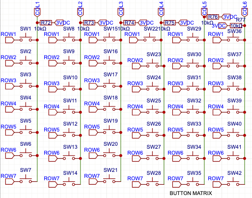

# ButtonManager

Part of the firmware `include` jungle. The [include README](../README.md) explains how button rage propagates; the [main firmware README](../../README.md) zooms out to the whole machine.

Scans the 7×6 button grid, smacks bounce in the teeth, and spits out events.



## Where it fits

ButtonManager owns the gesture map for the multiplexed button grid, updates slot/profile state through ConfigManager, feeds MIDIHandler, and flashes clues through LEDManager.

```
[Muxed buttons] --> ButtonManager --> MIDIHandler
                                \-> LEDManager
```

See the big picture in the [main firmware README](../../README.md).

## Key Methods

- `initButtons()` – wire up mux pins and ready the machines.
- `processButtons(ctx)` – poll the matrix and trigger actions.
- `isMuxButtonPressed(idx)` – peek a raw button for tests; works on `const`
  managers too.

## Typical Use

```cpp
#include "ButtonManager.h"

ButtonManager buttons(hwConfig, CONTROL_PINS, &pots);

void setup() {
  buttons.initButtons();
}

void loop() {
  buttons.processButtons(ctx);
}
```

That `hwConfig` bundle wrangles mux pins, LED counts, and timing so the tests and firmware slam in sync.

## Faster, non-blocking scans

`ButtonManager` used to pause for raw `delayMicroseconds()` calls every time it poked the mux. That was lazy. Now a tiny `waitForMuxSettle()` helper watches `micros()` and yields while the CD74HC4067 settles. The main loop keeps breathing and we still catch every click.

Mux select lines get smashed via a pre-baked lookup table and `digitalWriteFast()`, ditching the bit‑twiddling on every pass. Flip `BUTTON_MANAGER_PROFILE` in the build and you'll get Serial spam with average and max scan times—handy to prove we're not dropping states while chasing speed.

Dig deeper in [ButtonManager.h](../ButtonManager.h).

## Button Map

### Control Buttons

Need the cheat sheet for the six front-panel punks? Here it is.

_Long-press stunts ask for a quick confirm tap after you let go—no more accidental nukes._

| Button | Short Press                          | Long Press                      | Double Press                                                                |
| ------ | ------------------------------------ | ------------------------------- | --------------------------------------------------------------------------- |
| Ctrl0  | Toggle EF                            | Calibrate EF baseline           | Cycle EF filter forward                                                     |
| Ctrl1  | Next Slot                            | Reload active profile (cycle diagnostic page while diagnostics are active) | Cycle EF filter backward |
| Ctrl2  | Cycle EF assignment                  | Toggle Slot Active              | Cycle MIDI type (CC→Note→PitchBend→ProgramChange→Aftertouch→NRPN→RPN→SysEx) |
| Ctrl3  | Cycle MIDI Channel                   | Reload persisted configuration | Cycle EF oversampling (1x/2x/4x/8x/16x/32x)                                |
| Ctrl4  | Cycle registry number (CC/NRPN/RPN)  | Save active profile/config      | Toggle the active slot's ARG combiner                                       |
| Ctrl5  | Tap BPM (exit diagnostics if active) | Enter diagnostics / cycle pages | Toggle live LFO 1 modulation for the active slot                            |

Ctrl3–Ctrl5 use exclusive double presses. Their normal short-press action waits for the 300 ms double-press window to close, so changing oversampling does not also change the MIDI channel, toggling ARG does not increment `data1`, and toggling LFO 1 does not register a tempo tap. A chord consumes its participating button releases, preventing combo gestures from leaking these solo actions.

The Ctrl5 double press edits the active slot's fixed LFO 1 lane. A lane that has never been tuned starts in **Centered** mode at **100%** so enabling it immediately produces live modulation. Turning it off preserves mode and amount for the next enable. All three new double-press edits are saved to the slot and emitted as `slot_patch` updates so an attached configurator follows the hardware state.
When you arm the persisted-config reload (**Ctrl3**) or diagnostic toggle (**Ctrl5**) with a long press, the LED strip throws a full-strip warning animation. The red-and-white reload warning gives you time to cancel before unsaved runtime edits are replaced; the teal shimmer marks diagnostics.

### Slot Buttons

| Move                 | Action                                                                                                      |
| -------------------- | ----------------------------------------------------------------------------------------------------------- |
| Short press          | Select the slot                                                                                             |
| Long press + confirm | Assign/cycle an Envelope Follower and flip it on. After confirming, punch Control 0‑5 to pick a specific EF |

### Combo Moves

| Combo                 | What happens                     |
| --------------------- | -------------------------------- |
| Ctrl0 + Ctrl1 + Ctrl2 | Panic-safe baseline reset (stop arp, disable EF follow, reload active profile) |
| Ctrl0 + Ctrl1 + Ctrl3 | Toggle LFO quick-tune mode |
| Ctrl0 + Ctrl2 + Ctrl3 + Ctrl5 | Toggle on-device config mode |
| Ctrl3 + Ctrl4 + Ctrl5 | Toggle USB MIDI output           |
| Ctrl0 + Ctrl1         | Cycle EF ARG mode method         |
| Ctrl0 + Ctrl2         | Cycle ARG envelope pair          |
| Ctrl3 + Ctrl4         | Cycle LED display modes          |
| Ctrl0 + Ctrl4         | Enable EF and randomize settings |
| Ctrl4 + Ctrl5         | Set slot to MIDI Note mode       |
| Ctrl3 + Ctrl5         | Set slot to Program Change       |
| Ctrl0 + Ctrl5         | Set slot to Pitch Bend           |
| Ctrl1 + Ctrl4         | Set slot to Aftertouch           |
| Ctrl1 + Ctrl5         | Toggle MIDI clock output         |
| Ctrl1 + Ctrl4 + Ctrl5 | Toggle clock source (EXT/INT)    |
| Ctrl2 + Ctrl5         | Set slot to NRPN                 |
| Ctrl1 + Ctrl3         | Set slot to RPN                  |
| Ctrl0 + Ctrl3         | Set slot to SysEx                |
| Ctrl2 + Ctrl4         | Toggle Arpeggiator for a profile-assigned slot (short), Arp Edit (long press) |
| Ctrl2 + Ctrl3         | Bump arpeggiator base note (short), Swing preset (long press) |
| Ctrl1 + Ctrl2         | Cycle configuration profiles (A-D) |

The ARG combos (`Ctrl0+Ctrl1` / `Ctrl0+Ctrl2`) edit the active slot's ARG method or source pair and enable its ARG lane immediately. They do not require that slot to own a separate EF assignment.

On-device config mode remaps control buttons while active:

| Control | Action |
| ------- | ------ |
| Ctrl0 / Ctrl1 | Previous / next slot |
| Ctrl2 | Cycle slot type |
| Ctrl3 | Cycle channel |
| Ctrl4 | Cycle data1 (CC/NRPN/RPN) |
| Ctrl5 | Exit; autosave the active profile if config-mode edits are dirty |

LFO quick-tune mode remaps control buttons while active:

| Control | Action |
| ------- | ------ |
| Ctrl0 / Ctrl1 | Select LFO 1 / LFO 2 |
| Ctrl2 | Cycle shape |
| Ctrl3 | Toggle sync |
| Ctrl4 | Cycle internal route target (EF Gain -> Arp Swing -> Vel Shift -> Note Chance -> Arp Gate -> Jitter Depth -> Jitter Smooth) |
| CtrlPot2 | Set sync ratio (sync ON) or bipolar/unipolar (sync OFF) |
| Ctrl5 | Exit LFO quick-tune mode |

For deeper madness see the [firmware README](../../README.md).
