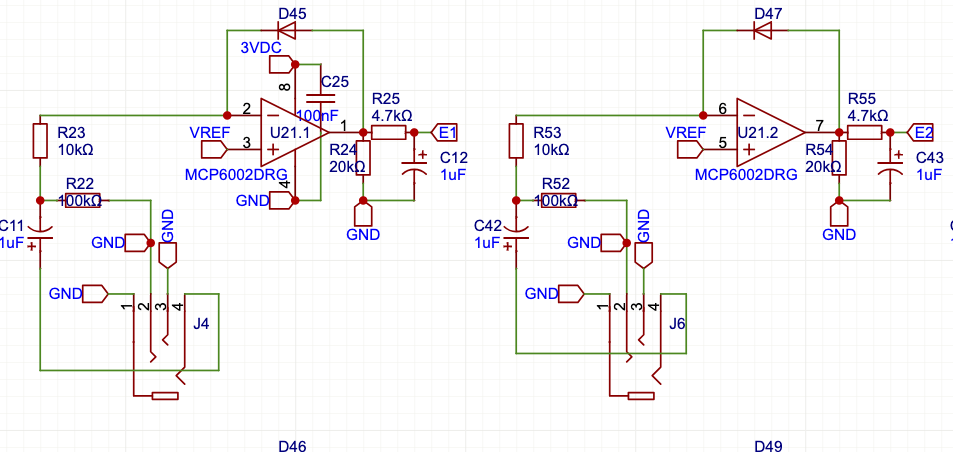

# EnvelopeFollower

Part of the firmware `include` jungle. Hit the [include README](../README.md) for how envelopes boss the rest, and the [main firmware README](../../README.md) for the system tour.

Sniffs audio or CV, shapes it, and hurls MIDI-friendly levels back.



## Where it fits

EnvelopeFollower reads an analog pin, smooths the chaos with BiquadFilter, and tosses values to MIDIHandler, LEDManager, or even Arpeggiator for note voodoo.

```
[Audio/CV] --> EnvelopeFollower --> MIDI/LED/Arp
```

See more wiring in the [main firmware README](../../README.md).

## Key Methods

- `update()` – sample the pin and cook the envelope.
- `applyToCC(potIndex, value)` – mash a CC with the current level.
- `setFilterType(type)` – pick your flavor of chaos.
- `calibrate()` – sniff `VREF_ADC_PIN`, zero the noise floor, stash offsets to EEPROM.

## Typical Use

```cpp
#include "EnvelopeFollower.h"

EnvelopeFollower env(A0, &pots, 0); // third arg tags it for EEPROM
env.setFilterType(EnvelopeFollower::LOWPASS);
env.setModulationTarget(10);
env.calibrate();       // learn the baseline, stash it in EEPROM
env.toggleActive(true);

void loop() {
  env.update();
}
```

### Smoothing tweaks

`setOversampleCount(n)` and `setSmoothingAlpha(f)` let you trade jitter for
latency. Crank the sample count for cleaner reads, bump the alpha for snappier
response. The defaults (4 samples, 0.2f) play nice with most rigs.

Scope its internals in [EnvelopeFollower.h](../EnvelopeFollower.h).

## Filter Types

Each follower can twist its response curve. Pick the one that matches your mood.

| Type | Shape | What it’s good for |
| ---- | ----- | ------------------ |
| `LINEAR` | Straight passthrough | Raw level mapped 1:1 |
| `OPPOSITE_LINEAR` | Inverted ramp | Flip loud to quiet and vice versa |
| `EXPONENTIAL` | Hot peaks, soft lows | Emphasize attacks, tame sustain |
| `RANDOM` | Perlin-spiced chaos | Organic wobble without repeating |
| `LOWPASS` | Biquad low-pass | Smooth out fizz above the cutoff |
| `HIGHPASS` | Biquad high-pass | Ignore slow swells and DC rumble |
| `BANDPASS` | Biquad band-pass | Solo a slice of the spectrum |

The last three lean on the [BiquadFilter](../BiquadFilter/README.md) module under the hood.

## ARG Methods

Flip an EF into **ARG** mode and it stops flying solo, blending two inputs with crude math and zero shame.
Here’s the bag of tricks—fourteen ways to mash envelopes:

| Method | Formula (A,B) | Vibe |
| ------ | ------------- | ---- |
| `PLUS` | `A + B` | Sum the pair and hope they get along |
| `MIN`  | `A - B` | Subtract B from A for a unipolar scuffle |
| `PECK` | `B - A` | Swap the order and pick at A instead |
| `SHAV` | `(A - B) / 10` | Same fight, dialed way down |
| `SQAR` | `sqrt(A*A + B*B)` | Vector magnitude mashup |
| `BABS` | `A / abs(B)` | Ratio mix, ignoring B’s sign |
| `TABS` | `(10 * A) / abs(B)` | BABS with a ×10 ego boost |
| `MULT` | `(A * B) / 127` | Ring‑mod mayhem; sidebands for days |
| `DIVI` | `(A * 127) / (B + 1)` | A surfing B without divide-by-zero shrapnel |
| `AVG`  | `(A + B) / 2` | Peace treaty crossfade |
| `XABS` | `abs(A - B)` | Who’s louder? Absolute throwdown |
| `MAXX` | `max(A, B)` | Crown the louder envelope |
| `MINN` | `min(A, B)` | Stick with the wallflower |
| `XORR` | `A ^ B` | Bitwise glitch punk |

Deep dive into ARG routing in the [main firmware README](../../README.md#arg-mode).
