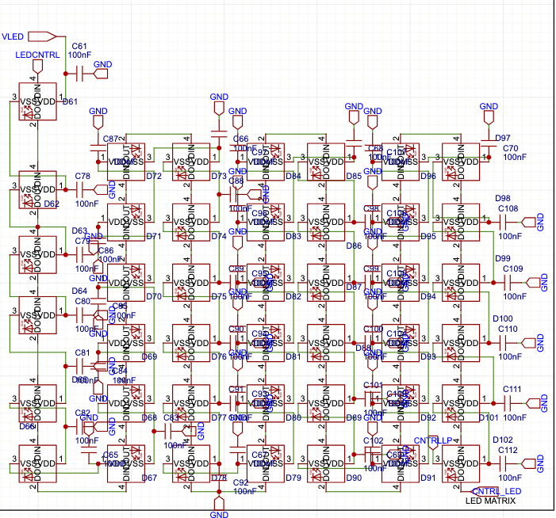

# LEDManager

Part of the firmware `include` jungle. Scope the [include README](../README.md) to see how the glow plugs in and the [main firmware README](../../README.md) for the megawatt overview.

Runs the 52-piece WS2812 light riot and keeps it barely under control.



## Where it fits

LEDManager mirrors pot moves and config quirks on a WS2812 strip; EnvelopeFollower can hijack it for visual throb.

```
[Pots/Config] --> LEDManager --> WS2812 strip
```

Catch the full scene in the [main firmware README](../../README.md).

## Key Methods

- `begin()` – initialize FastLED and blank the strip.
- `setPotValue(idx, value)` – mirror a slot's value on its halo.
- `setPixelColor(idx, color)` – paint one exact RGB color onto one LED.
- `update()` – push any dirty pixels out to the wire.

## Default State

Fresh out of construction, `LEDManager` is chilling in `LEDState::IDLE` with
`activeIndex` parked at `255` – a sentinel meaning "no LED is currently under
the spotlight."  It's a clean slate; nothing gets lit until you tell it to.

## Power Safety Note

`LEDManager` now boots from the board power profile in
[`BoardPowerProfile.h`](../BoardPowerProfile.h):

- `-DMN42_BOARD_POWER_PROFILE=POWER_CHOKED_V1` caps all runtime/demo/bench brightness at `26`.
- `-DMN42_BOARD_POWER_PROFILE=SPLIT_RAIL_REWORK` lifts the hard cap to `255` after the split-rail rework is verified.

These limits reduce current spikes, but they do not replace correct power
topology. Full-strip white on 52 WS2812 LEDs can exceed `3 A`, so confirm the
LED rail fuse branch and use a regulated `5 V` supply before high-current tests.
The active profile is reported through `GET_MANIFEST` as `power_profile`,
`led_brightness_cap`, and `rail_topology_verified`.

## Typical Use

```cpp
#include "Globals.h"
#include "LEDManager.h"

// `hwConfig` gets filled at boot with pin numbers and LED counts.
LEDManager leds(hwConfig);

void setup() {
  leds.begin();
}

void loop() {
  leds.setPotValue(0, 127);
  leds.update();
}
```

## HardwareConfig: the Puppet Master

Tired of magic numbers? `HardwareConfig` (defined in [`Globals.h`](../Globals.h)) still
tracks the board's pins and timing knobs. `LEDManager` leans on it for odds and
ends like the status LED, but the strip's data pin is now a compile-time rebel:
`LED_DATA_PIN` in `platformio.ini` decides where the bits fly. Want to reroute
the glow? Change that flag and rebuild—runtime config won't save you.

Peer at the wiring in [LEDManager.h](../LEDManager.h).
