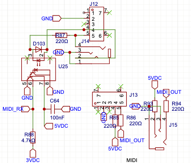

# MIDIHandler

Part of the firmware `include` jungle. Scope the [include README](../README.md) to see where the bytes route and the [main firmware README](../../README.md) for the full wiring diagram.

USB, DIN, TRS—whatever—this thing speaks MIDI like it's 1983 and even keeps time for the slackers.
USB input now filters out bogus message types, like a bouncer keeping the freaks off the dance floor.

> Need a refresher on channels, CCs, or SysEx framing? Slide over to the [MIDI + DSP 101 Primer](../../../docs/Primers/MIDI-DSP101.md#midi-in-60-seconds) before wiring new handlers.



## Supported Message Types

When the real USB stack is in play, `isSupportedType()` stands at the door checking IDs. Here's who gets in:

| Type | What it’s good for |
| ---- | ------------------ |
| `ControlChange` | Knobs, mod wheels, sliders, and anything twisty |
| `NoteOn` | Because silence is boring |
| `NoteOff` | Every party ends |
| `ProgramChange` | Swap patches without drama |
| `AfterTouchChannel` | Channel pressure for the expressive crowd |
| `PitchBend` | Wiggle that pitch like you mean it |
| `SystemExclusiveStart` | Opening byte for SysEx dumps |
| `Tick` | 24 PPQN MIDI clock pulses |

Flip on the `USB_MIDI_STUB` build flag and the bouncer clocks out: the USB path is mocked, no filtering happens, and `isSupportedType` disappears from the scene.

## Where it fits

ButtonManager, PotentiometerManager, and Arpeggiator shove events in; the USB, DIN, and TRS ports blast them out. ConfigManager sets the channels and tempo law.

```
[Buttons/Pots/Arp] --> MIDIHandler --> USB/DIN/TRS jacks
```

More context lives in the [main firmware README](../../README.md).

## Key Methods

- `begin()` – open both MIDI pipes.
- `sendControlChange(cc, value, channel)` – fire a CC.
- `sendModWheel(value, channel)` – slam CC1 like the synth came with a mohawk.
- `sendClock()` – spit out a raw 0xF8 when you want to be the metronome.
- `generateClockTick()` – stamp an internal clock pulse that also mirrors out over MIDI.
- `clockTickCount()` – running tally of every pulse heard or generated so arpeggiators can stay glued to the grid.
- `processIncomingMIDI()` – keep an ear on incoming bytes **and** spew MIDI clock when `g_tappedBPM` says so.
- `handleMIDI(type, channel, data1, data2)` – strong-typed dispatch using `midi::MidiType` so stray bytes don't crash the party.

Clock out defers to any incoming tempo; if the outside world goes dark for `CLOCK_TIMEOUT_MS`
the tapped BPM drags the beat back to life. Smash Control #1 + #2 to toggle that clock stream
whenever you feel like it.

## Typical Use

```cpp
#include "MIDIHandler.h"

MIDIHandler midi;

void setup() {
  midi.begin();
  midi.sendControlChange(74, 99, 1);
}

void loop() {
  midi.processIncomingMIDI();
}
```

Scope the I/O in [MIDIHandler.h](../MIDIHandler.h).
