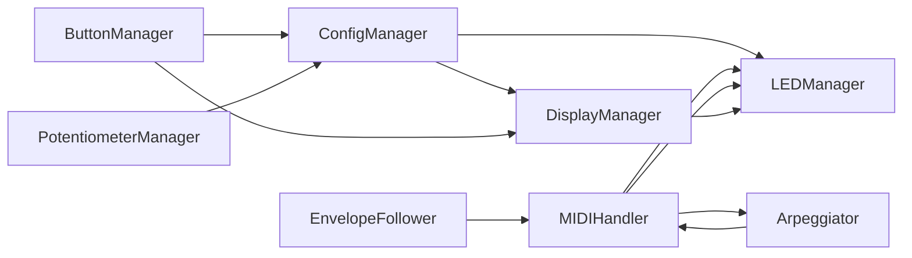

# Header Overview

> Interface declarations and helper bits used across the MN42 firmware.
> If you're hacking on the code, start here.

This folder holds the C++ headers that glue the controller together.
Each file corresponds to a manager class or shared structure.
Below is a quick cheat sheet.

Most modules stash a mini README in their own subfolder for API riffs—check `*/README.md` for details while you hack.

If you are entering from `src/firmware_main.cpp`, use the ordered header path in
[../../docs/firmware/FirmwareMainReadingPath.md](../../docs/firmware/FirmwareMainReadingPath.md)
before wandering file-by-file.

## Files

- **Arpeggiator.h** – simple timed note repeater for any slot ([Arpeggiator.cpp](../src/Arpeggiator.cpp)).
- **BiquadFilter.h** – lightweight filter used by the envelope followers.
- **ButtonManager.h** – scans the button matrix and debounces presses ([ButtonManager.cpp](../src/ButtonManager.cpp)).
- **ConfigManager.h** – reads/writes configuration to EEPROM ([ConfigManager.cpp](../src/ConfigManager.cpp)).
- **DisplayManager.h** – wrappers around the SSD1306 OLED display ([DisplayManager.cpp](../src/DisplayManager.cpp)).
- **EnvelopeFollower.h** – tracks audio or CV to modulate slots ([EnvelopeFollower.cpp](../src/EnvelopeFollower.cpp)).
- **Globals.h** – compile-time constants and forward declarations ([Globals.cpp](../src/Globals.cpp)).
  - Hosts cross-cutting toggles like `webSerialStreaming` so both the main firmware and the test harness agree on when to shout telemetry over USB.
- **FirmwareState.h** – the runtime cast list: which shared managers, followers, caches, and UI flags are alive once the board boots ([SystemState.cpp](../src/SystemState.cpp)).
- **hardware_config.h** – optional `applyHardwareRuntimeTuningOverrides()` hook for scheduler cadence. Structural wiring is fixed at build time because managers capture it before `setup()`.
- **LEDManager.h** – drives the 52-piece addressable LED circus: slot halos, envelope meters, pot glows and the control-button beacon ([LEDManager.cpp](../src/LEDManager.cpp)).
 - **MIDIHandler.h** – thin wrapper for USB, DIN, and TRS MIDI I/O ([MIDIHandler.cpp](../src/MIDIHandler.cpp)).
- **MIDITypes.h** – enums and structs defining slot data.
- **PotentiometerManager.h** – reads analog pots via multiplexers ([PotentiometerManager.cpp](../src/PotentiometerManager.cpp)).
- **TestHelpers.h** – small helpers used by the manual test firmware.
  - Defines the test-only `webSerialStreaming` stub that keeps the linker cool while we run isolated system suites.
- **Utility.h** – math mischief like `scale()` for warping ranges and a lightweight task scheduler ([Utility.cpp](../src/Utility.cpp)).
- **WebSerial.h** – ships slot snapshots over USB for the web editor ([WebSerial.cpp](../src/WebSerial.cpp)).
- **name.c** – sets the custom USB MIDI product string.
- **sys/report.h** – spits a JSON system report with FW version, Git hash, and juicy build/board stats.
- **protocol/** – host/configurator declarations and handler-family seams ([protocol/README.md](protocol/README.md)).

## How these pieces jam together

- `ButtonManager` hollers when a switch gets smacked and `LEDManager` answers with a light show, while `DisplayManager` scribbles the update on the OLED.
- `PotentiometerManager` pours raw knob juice into `ConfigManager`, which then nudges `LEDManager` and `DisplayManager` so your fingers see what your ears are about to hear.
- `MIDIHandler` routes incoming notes and clock, letting `Arpeggiator` and `EnvelopeFollower` sync their mischief; `BiquadFilter` keeps the follower's wiggles smooth.
- `WebSerial` taps `ConfigManager` to fling slot snapshots over USB for external editors or debugging.

## Hardware hookups

| Module | Hardware hookup |
| --- | --- |
| **ButtonManager** | 42 matrix buttons plus 6 direct-wired control punks |
| **PotentiometerManager** | 42 analog slots fed through muxes |
| **LEDManager** | 52 WS2812 rebels (42 slot halos, 6 EF meters, 1 control-actuated beacon, 3 pot indicators) |
| **EnvelopeFollower** | 6 envelope-sniffing inputs |
| **DisplayManager** | 128x64 SSD1306 OLED canvas |
| **MIDIHandler** | USB, 5-pin DIN, and 1/8" TRS ports |

For the full firmware story see [../README.md](../README.md).
