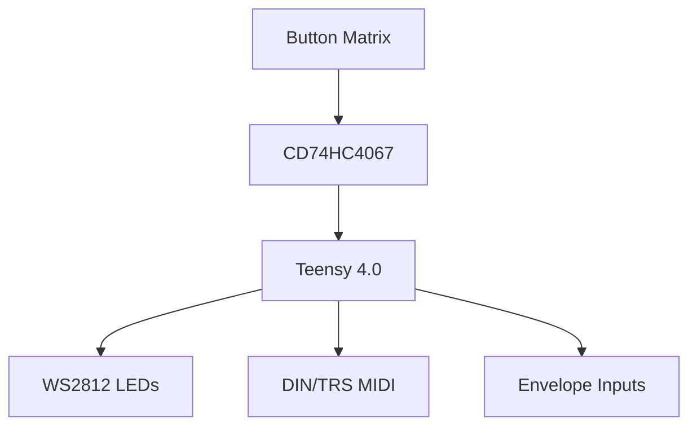

# BTN_42 Hardware

> ~~The button board that turns the firmware's dreams into something you can actually solder.~~ Pure DIY attitude. Latest layout adds ten addressable LEDs—one shadowing each envelope follower input, one glaring at the control buttons, and three haloing the physical pots—and now drops in 1/8" Type‑A MIDI jacks alongside the old-school DIN ports.

[^logic][^midi]

[^opamp]

Need a deeper schematic fix? The [systemflow docs](../docs/sketch/systemFlow/hw/) slice the board into subsystems with all the gnarly traces.

## Specs

- **Microcontroller**: Teensy 4.0 — 600 MHz of ARM punk powering the show.
  > **Why this part?** Tiny, fast and already speaks USB MIDI. The [Teensy 4.0 Hookup Guide](https://learn.sparkfun.com/tutorials/teensy-40-hookup-guide) shows pinout, power limits, and how to flash the module without bricking it.
- **Addressable LEDs**: 52 × WS2812-style — six stalk the envelope followers, one heckles the control buttons, and three crown the pots.
  > **Why this part?** WS2812s daisy-chain over a single pin and scream in full RGB. SparkFun's [WS2812 Breakout Hookup Guide](https://learn.sparkfun.com/tutorials/ws2812-breakout-hookup-guide) covers timing voodoo and power decoupling.
- **Envelope Follower Inputs**: 6 analog channels ready for audio or CV (+5V).
  > **Why this part?** A dirt-cheap MCP6002 op-amp rectifies and smooths the signal so the Teensy can sniff envelope peaks. SparkFun's [Op-Amp Basics](https://learn.sparkfun.com/tutorials/op-amps/all) walks through precision rectifiers like the one on this board.
- **Key Matrix MUX**: Two CD74HC4067s funnel forty‑two switches into a single ADC read.
  > **Why this part?** Saves pins and sanity. The [16-Channel Mux Breakout Guide](https://learn.sparkfun.com/tutorials/16-channel-analogdigital-multiplexer-breakout-cd74hc4067-hookup-guide) shows how to prototype the trick with a breakout before you spin copper.
- **Power**: 5 V logic rail plus a 5 V LED rail; core fuse at 0.5 A, LED fuse at 2.5 A.
  > **Why this part?** Separate rails keep LEDs from sagging the logic. SparkFun's [Fuse Tutorial](https://learn.sparkfun.com/tutorials/fuses) explains why we protect each branch.
- **MIDI I/O**: 5‑pin DIN plus 1/8" TRS Type‑A jacks wired in parallel.
  > **Why this part?** A 6N138 optocoupler isolates MIDI IN so rogue gear doesn't fry the Teensy. SparkFun's [MIDI Tutorial](https://learn.sparkfun.com/tutorials/midi-tutorial/all) digs into DIN vs. TRS wiring and opto isolation.

The firmware slurps up every one of these hooks—animating LEDs, sampling EFs, and watching the rails. Check the [firmware README](../firmware/README.md) for how the code bends the hardware to its will.

## Directory Layout

- [BOM_MOAR_MOAR_Board_2025-08-02.xlsx](BOM_MOAR_MOAR_Board_2025-08-02.xlsx) – the parts shopping list.
- [fabrication/Gerber_MOAR_Board_2025-08-17.zip](fabrication/Gerber_MOAR_Board_2025-08-17.zip) – fab-ready package for the latest spin.
- [shell/](shell/) – STEP and STL models of the enclosure.

## Power Rails Need Fat Copper

If you're routing or poking at the LED power network, keep the lifeblood thick:

- `VCC`
- `5V`
- `VLED`
- any other LED power rail hiding in your design

In EasyEDA (or whatever CAD you're rocking), filter on each of those nets, hover the trace, and smash **Change Width** until it's **0.5 mm or wider**.  After you push the update, regenerate the Gerbers and crack open `fabrication/Gerber_MOAR_Board_2025-08-17.zip`'s `TopLayer.GTL`—the smallest `%ADD` aperture should scream `0.5` or bigger.  Thin copper means brown‑outs and sad pixels, so keep it beefy.

## Fabrication Package

Everything you need to spin boards is sitting in this repo, no scavenger hunt required:

- [fabrication/Gerber_MOAR_Board_2025-08-17.zip](fabrication/Gerber_MOAR_Board_2025-08-17.zip) – unzip and punt it straight to your board house.
- [BOM_MOAR_MOAR_Board_2025-08-02.xlsx](BOM_MOAR_MOAR_Board_2025-08-02.xlsx) – full bill of materials.
- `shell/` – STL files in `3DShell_btnBRD/` and printable meshes in `stl/`.

Circuit diagrams live in [`sketch/`](../docs/sketch/). System modules have their circuits diagramed to show the board's guts in living color.

### Sketch Documents

* Matrix Diode Array [buttonMatrix.md](../docs/sketch/systemFlow/hw/buttonMatrix.md)
* Power and Protection [power&protection.md](../docs/sketch/systemFlow/hw/power&protection.md)
* PLC/Voltage shifters [teensy&headers.md](../docs/sketch/systemFlow/hw/teensy&headers.md)
* MIDI OUT [led&midiOut.md](../docs/sketch/systemFlow/hw/led&midiOut.md)
* MIDI IN [midiOpto.md](../docs/sketch/systemFlow/hw/midiOpto.md)
* Envelope Follower [envelopeFE.md](../docs/sketch/systemFlow/hw/envelopeFE.md)
* Display [display.md](../docs/sketch/systemFlow/hw/display.md)

### SparkFun Shortcut

If these things seem WAY over your head, don't worry. They were for me too, at first. A cool thing is that SparkFun fabs the Teensy line and sells breakouts for nearly every silicon misfit on this board. Grab a dev board, follow one of their many tutorials, and prototype before you ever open a PCB editor.

| Part | SparkFun Link | What the article covers |
| --- | --- | --- |
| Teensy 4.0 | [Hookup Guide](https://learn.sparkfun.com/tutorials/teensy-40-hookup-guide) | Pinout, power, programming basics |
| WS2812 / NeoPixel LED | [WS2812 Breakout Guide](https://learn.sparkfun.com/tutorials/ws2812-breakout-hookup-guide) | Driving addressable LEDs and power tips |
| CD74HC4067 MUX | [16‑Channel Mux Guide](https://learn.sparkfun.com/tutorials/16-channel-analogdigital-multiplexer-breakout-cd74hc4067-hookup-guide) | Reading 16 channels through one port |
| SN74HCT245 Level Shifter | [Logic Level Shifting 101](https://learn.sparkfun.com/tutorials/logic-level-shifting) | Translating 5 V button buses to 3 V3 logic |
| 6N138 MIDI Opto | [MIDI Tutorial](https://learn.sparkfun.com/tutorials/midi-tutorial/all) | Opto‑isolated MIDI wiring and DIN vs. TRS |
| SSD1306 OLED | [Micro OLED Breakout Guide](https://learn.sparkfun.com/tutorials/micro-oled-breakout-hookup-guide) | I²C wiring and drawing pixels |

#### If this, then that

- Want variable CV routing? Swap in SparkFun's [CD74HC4067 breakout](https://www.sparkfun.com/products/9056) and reroute envelopes without soldering.
- Testing MIDI before committing to the PCB? Their [MIDI Shield](https://www.sparkfun.com/products/12898) drops a ready-made DIN/optocoupler stage on your bench.

[^logic]: SparkFun's [Logic Level Shifting 101](https://learn.sparkfun.com/tutorials/logic-level-shifting) article explains the SN74HCT245 block on sheet 5.
[^midi]: SparkFun's [MIDI Tutorial](https://learn.sparkfun.com/tutorials/midi-tutorial/all) covers opto-isolation and TRS vs. DIN wiring used on sheet 6.
[^opamp]: SparkFun's [Op-Amp Basics](https://learn.sparkfun.com/tutorials/op-amps/all) digs into the rectifier + RC filter behind the envelope follower on sheet 7.

Below is a summary of the schematic sheets:

| Sheet # | Title                                  | Contents                                                                                       |
| ------- | -------------------------------------- | ---------------------------------------------------------------------------------------------- |
| 1       | Title / Block Diagram                  | Topology overview; signal & power flow.                                                        |
| 2       | **Power & Protection**                 | DC jack, F1 logic PTC, TVS, bulk caps, F2 LED PTC, VLED cap, regulators note (Teensy onboard). |
| 3       | **Teensy Core & Headers**              | Teensy 4.0 pinout subset used; I2C to OLED; SPI/unused pads; boot/reset.                       |
| 4       | **Key Matrix & MUX**                   | 42 switches + diodes; 2×CD74HC4067 (or # actually used); row/col nets labelled; OE pull-ups.   |
| 5       | **Level-Shifter & LED / MIDI OUT**     | SN74HCT245, RLED 33 Ω, MIDI OUT loop resistors, DIN + TRS connectors.                                 |
| 6       | **MIDI IN Opto + ESD**                 | 6N138 (or alt), input resistors, 3V3 pull-up, optional activity LED, DIN + TRS jacks.                           |
| 7       | **Envelope Follower Analog Front-End** | 6 channels: audio jack (or header), rectifier, RC, clamp to 3V3, into ADC pins.                |
| 8       | **Display, UI, Aux Headers**           | SSD1306 (I²C), spare expansion header (5V, 3V3, SDA, SCL, GND), debug SWD pads.                |
| 9       | Netlist summary / BOM cross-ref.       |                                                                                                |

### Analog Ground Stitching

The envelope follower front-end is a noise magnet, so we drenched it in a GND pour and pinned that copper down with vias every ~5 mm. Each stitch dives into the main ground plane so the envelope follower keeps quiet. If you mod this section or stretch the board, clone those vias and keep the spacing tight—same net, same vibe. Peek inside `fabrication/Gerber_MOAR_Board_2025-08-17.zip` for `Drill_PTH_Through_Via.DRL` to copy the pattern and march them along your new edge.

## Safety & Liability

This board might only hum on 5 V, but those rails can deliver enough current to toast silicon or your fingertips. Plugging things in backwards, bypassing fuses, or letting stray tools bridge traces can nuke chips, start fires, or light up the room in the worst way. Treat every conductor like it wants to bite—double-check polarity, respect current limits, and never poke live circuits unless you know exactly what you're doing.

Build, mod, or rage against this design at your own risk. We’re not your safety net. As the [CERN OHL v2 warranty disclaimer](LICENSE) bluntly states, this documentation and any hardware you spawn from it come **"as is"** with zero warranties or guarantees. If you cook a bench supply, weld a ring to a ground plane, or shock yourself into next week, that’s on you, not us.

## License

These board blueprints are under the CERN Open Hardware Licence v2 - Strongly Reciprocal. Remix, fab, and share alike. Scope the [LICENSE](LICENSE) in this folder for the full legal spiel.

