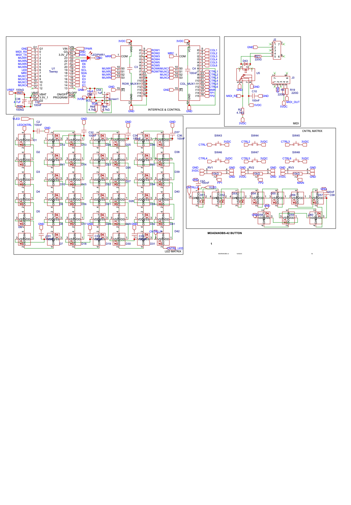

# BTN_42 Hardware

> The button board that turns the firmware's dreams into something you can actually solder. Pure DIY attitude. Latest layout adds ten addressable LEDs—one shadowing each envelope follower input, one glaring at the control buttons, and three haloing the physical pots—and now drops in 1/8" Type‑A MIDI jacks alongside the old-school DIN ports.

## Specs

- **Microcontroller**: Teensy 4.0 — 600 MHz of ARM punk powering the show.
- **Addressable LEDs**: 10 × WS2812-style — six stalk the envelope followers, one heckles the control buttons, and three crown the pots.
- **Envelope Follower Inputs**: 6 analog channels ready for audio or CV.
- **Power**: 5 V logic rail plus a 5 V LED rail; core fuse at 0.5 A, LED fuse at 2.5 A.
- **MIDI I/O**: 5‑pin DIN plus 1/8" TRS Type‑A jacks wired in parallel.

The firmware slurps up every one of these hooks—animating LEDs, sampling EFs, and watching the rails. Check the [firmware README](../firmware/README.md) for how the code bends the hardware to its will.

## Directory Layout

- [BOM_MOAR_MOAR_Board_2025-08-02.xlsx](BOM_MOAR_MOAR_Board_2025-08-02.xlsx) – the parts shopping list.
- [fabrication/Gerber_MOAR_Board_2025-08-17.zip](fabrication/Gerber_MOAR_Board_2025-08-17.zip) – fab-ready package for the latest spin.
- [shell/](shell/) – STEP and STL models of the enclosure.

## Power Rails Need Fat Copper

If you're routing or poking at the LED power network, keep the lifeblood thick:

- `VCC`
- `5V`
- `VLED`
- any other LED power rail hiding in your design

In EasyEDA (or whatever CAD you're rocking), filter on each of those nets, hover the trace, and smash **Change Width** until it's **0.5 mm or wider**.  After you push the update, regenerate the Gerbers and crack open `fabrication/Gerber_MOAR_Board_2025-08-17.zip`'s `TopLayer.GTL`—the smallest `%ADD` aperture should scream `0.5` or bigger.  Thin copper means brown‑outs and sad pixels, so keep it beefy.

## Fabrication Package

Everything you need to spin boards is sitting in this repo, no scavenger hunt required:

- [fabrication/Gerber_MOAR_Board_2025-08-17.zip](fabrication/Gerber_MOAR_Board_2025-08-17.zip) – unzip and punt it straight to your board house.
- [BOM_MOAR_MOAR_Board_2025-08-02.xlsx](BOM_MOAR_MOAR_Board_2025-08-02.xlsx) – full bill of materials.
- `shell/` – STEP files in `3DShell_btnBRD/` and printable meshes in `stl/`.

Sketch diagrams live in [`sketch/`](../docs/sketch/). The `PNG_MOAR_Schematic` folder holds exported PNG screenshots of the full EasyEDA schematic.

### Sketch Documents

* [buttonMatrix.md](../docs/sketch/systemFlow/hw/buttonMatrix.md)
* [power&protection.md](../docs/sketch/systemFlow/hw/power&protection.md)
* [teensy&headers.md](../docs/sketch/systemFlow/hw/teensy&headers.md)
* [led&midiOut.md](../docs/sketch/systemFlow/hw/led&midiOut.md)
* [midiOpto.md](../docs/sketch/systemFlow/hw/midiOpto.md)
* [envelopeFE.md](../docs/sketch/systemFlow/hw/envelopeFE.md)
* [display.md](../docs/sketch/systemFlow/hw/display.md)

### Sparkfun Reference Stash

Sparkfun now fabs the Teensy line and keeps a bench full of breakout boards
for nearly every silicon misfit on this PCB.  When you want to trace a part
back to a friendly tutorial or snag a quick dev board, start here:

- **Teensy 4.0** – [Teensy 4.0 Hookup Guide](https://learn.sparkfun.com/tutorials/teensy-40-hookup-guide)
  and [product page](https://www.sparkfun.com/products/15583).
- **WS2812 / NeoPixel LED** – [WS2812 Breakout Hookup Guide](https://learn.sparkfun.com/tutorials/ws2812-breakout-hookup-guide)
  for addressable color chaos.
- **CD74HC4067 MUX** – [16‑Channel Mux Breakout Guide](https://learn.sparkfun.com/tutorials/16-channel-analogdigital-multiplexer-breakout-cd74hc4067-hookup-guide)
  lines up with the board's switch matrix.
- **SN74HCT245 Level Shifter** – Sparkfun’s [Logic Level Shifting](https://learn.sparkfun.com/tutorials/logic-level-shifting)
  primer covers why this octal bus transceiver keeps 5 V and 3.3 V from fist‑fighting.
- **6N138 MIDI Opto** – [MIDI Tutorial](https://learn.sparkfun.com/tutorials/midi-tutorial/all)
  walks through the isolated input stage we cribbed.
- **SSD1306 OLED** – [Micro OLED Breakout Guide](https://learn.sparkfun.com/tutorials/micro-oled-breakout-hookup-guide)
  if you want extra pixels to blink at.

### Thermal Sanity Checks

- Make sure the regulator and LED-driver zones have fat copper pours or bolt-on heatsinks. No one likes roasted silicon.
- Still worried about temps? Go for larger packages or share the current across multiple regulators so nothing melts.
- Wanna nerd out harder? The [thermal crash course](../docs/thermal/README.md) walks through keeping the board chill.

Below is a summary of the schematic sheets:

| Sheet # | Title                                  | Contents                                                                                       |
| ------- | -------------------------------------- | ---------------------------------------------------------------------------------------------- |
| 1       | Title / Block Diagram                  | Topology overview; signal & power flow.                                                        |
| 2       | **Power & Protection**                 | DC jack, F1 logic PTC, TVS, bulk caps, F2 LED PTC, VLED cap, regulators note (Teensy onboard). |
| 3       | **Teensy Core & Headers**              | Teensy 4.0 pinout subset used; I2C to OLED; SPI/unused pads; boot/reset.                       |
| 4       | **Key Matrix & MUX**                   | 42 switches + diodes; 2×CD74HC4067 (or # actually used); row/col nets labelled; OE pull-ups.   |
| 5       | **Level-Shifter & LED / MIDI OUT**     | SN74HCT245, RLED 33 Ω, MIDI OUT loop resistors, DIN + TRS connectors.                                 |
| 6       | **MIDI IN Opto + ESD**                 | 6N138 (or alt), input resistors, 3V3 pull-up, optional activity LED, DIN + TRS jacks.                           |
| 7       | **Envelope Follower Analog Front-End** | 6 channels: audio jack (or header), rectifier, RC, clamp to 3V3, into ADC pins.                |
| 8       | **Display, UI, Aux Headers**           | SSD1306 (I²C), spare expansion header (5V, 3V3, SDA, SCL, GND), debug SWD pads.                |
| 9       | Netlist summary / BOM cross-ref.       |                                                                                                |

### Analog Ground Stitching

The envelope follower front-end is a noise magnet, so we drenched it in a GND pour and pinned that copper down with vias every ~5 mm. Each stitch dives into the main ground plane so the envelope follower keeps quiet. If you mod this section or stretch the board, clone those vias and keep the spacing tight—same net, same vibe. Peek inside `fabrication/Gerber_MOAR_Board_2025-08-17.zip` for `Drill_PTH_Through_Via.DRL` to copy the pattern and march them along your new edge.

## Safety & Liability

This board might only hum on 5 V, but those rails can deliver enough current to toast silicon or your fingertips. Plugging things in backwards, bypassing fuses, or letting stray tools bridge traces can nuke chips, start fires, or light up the room in the worst way. Treat every conductor like it wants to bite—double-check polarity, respect current limits, and never poke live circuits unless you know exactly what you're doing.

Build, mod, or rage against this design at your own risk. We’re not your safety net. As the [CERN OHL v2 warranty disclaimer](LICENSE) bluntly states, this documentation and any hardware you spawn from it come **"as is"** with zero warranties or guarantees. If you cook a bench supply, weld a ring to a ground plane, or shock yourself into next week, that’s on you, not us.

## License

These board blueprints are under the CERN Open Hardware Licence v2 - Strongly Reciprocal. Remix, fab, and share alike. Scope the [LICENSE](LICENSE) in this folder for the full legal spiel.

