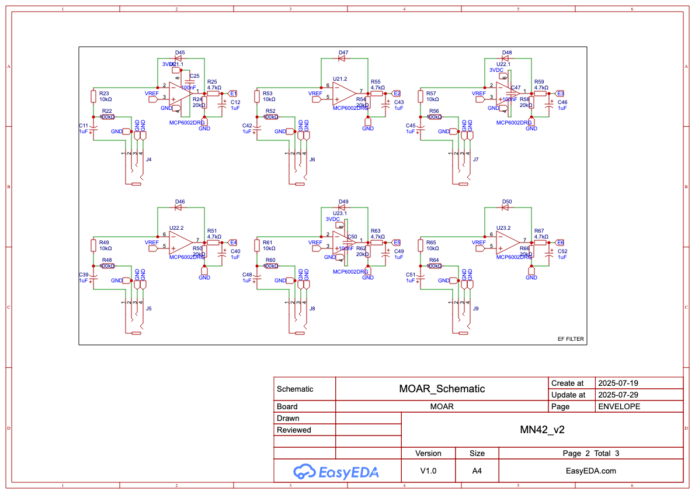
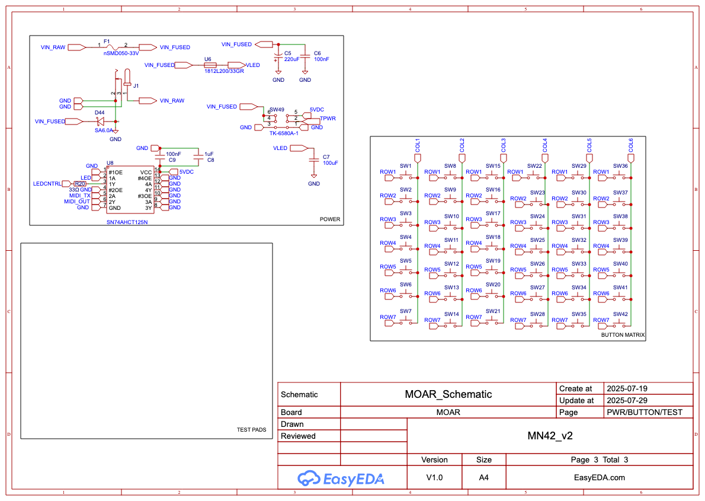

# BTN_42 Hardware

> The button board that turns the firmware's dreams into something you can actually solder. Pure DIY attitude.

## MN42-1

The `MN42-1` folder holds the first PCB revision:

- [BOM_btnBRD_btnBRD_2025-04-17.xlsx](MN42-1/BOM_btnBRD_btnBRD_2025-04-17.xlsx) – complete bill of materials.
- [PickAndPlace_btnBRD_2025-04-17.xlsx](MN42-1/PickAndPlace_btnBRD_2025-04-17.xlsx) – reference positions for automated assembly.
- [Gerber_btnBRD_2025-04-17.zip](MN42-1/Gerber_btnBRD_2025-04-17.zip) – ready-to-send fabrication package.
- `shell/` – STEP and STL models of the enclosure. `3DShell_btnBRD/` holds the STEP files, while `stl/` contains printable STL meshes.

Sketch diagrams live in [`sketch/`](../docs/sketch/). The `PNG_MOAR_Schematic` folder contains exported PNG screenshots of the full EasyEDA schematic.

### Sketch Documents

* [buttonMatrix.md](../docs/sketch/buttonMatrix.md)
* [power&protection.md](../docs/sketch/power&protection.md)
* [teensy&headers.md](../docs/sketch/teensy&headers.md)
* [led&midiOut.md](../docs/sketch/led&midiOut.md)
* [midiOpto.md](../docs/sketch/midiOpto.md)
* [envelopeFE.md](../docs/sketch/envelopeFE.md)
* [display.md](../docs/sketch/display.md)

Below is a summary of the schematic sheets:

| Sheet # | Title                                  | Contents                                                                                       |
| ------- | -------------------------------------- | ---------------------------------------------------------------------------------------------- |
| 1       | Title / Block Diagram                  | Topology overview; signal & power flow.                                                        |
| 2       | **Power & Protection**                 | DC jack, F1 logic PTC, TVS, bulk caps, F2 LED PTC, VLED cap, regulators note (Teensy onboard). |
| 3       | **Teensy Core & Headers**              | Teensy 4.0 pinout subset used; I2C to OLED; SPI/unused pads; boot/reset.                       |
| 4       | **Key Matrix & MUX**                   | 42 switches + diodes; 2×CD74HC4067 (or # actually used); row/col nets labelled; OE pull-ups.   |
| 5       | **Level-Shifter & LED / MIDI OUT**     | SN74HCT245, RLED 33 Ω, MIDI OUT loop resistors, DIN connector.                                 |
| 6       | **MIDI IN Opto + ESD**                 | 6N138 (or alt), input resistors, 3V3 pull-up, optional activity LED.                           |
| 7       | **Envelope Follower Analog Front-End** | 6 channels: audio jack (or header), rectifier, RC, clamp to 3V3, into ADC pins.                |
| 8       | **Display, UI, Aux Headers**           | SSD1306 (I²C), spare expansion header (5V, 3V3, SDA, SCL, GND), debug SWD pads.                |
| 9       | Netlist summary / BOM cross-ref.       |                                                                                                |

## License

All hardware files are released under the MIT License, matching the rest of this repository. See the [LICENSE](../LICENSE) file for details.
