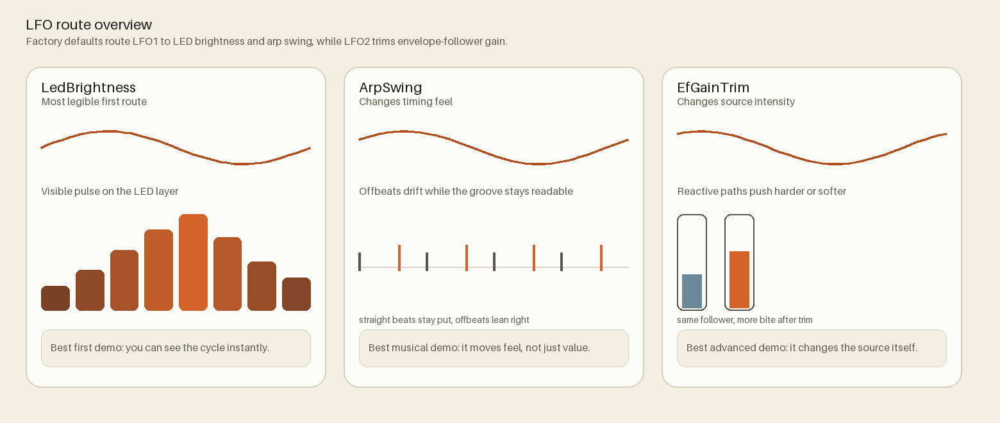
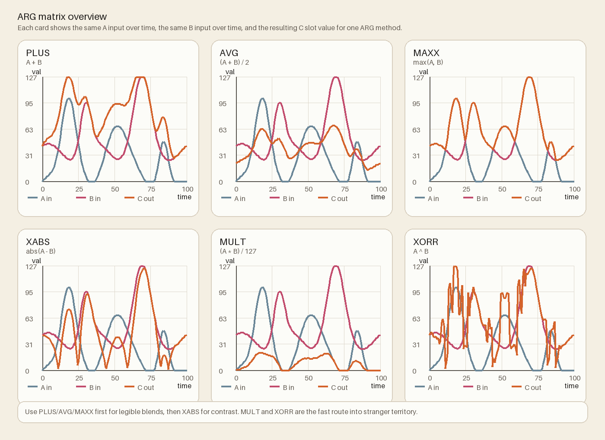

# Firmware

Firmware lives under `firmware/` and targets Teensy 4.0.
Canonical source: `firmware/README.md`

## Build commands

Run from repo root:

```bash
pio run -d firmware -e teensy40_main
pio run -d firmware -e teensy40_main -t upload
```

## Test environments

- `teensy40_full_system`
- `teensy40_unified_test`
- `teensy40_biquad_test`
- `teensy40_eeprom_persistence`
- `teensy40_slot_verify`
- `teensy40_unity` (Unity harness)

## Key modules

- `ButtonManager` - matrix scanning, gesture handling
- `PotentiometerManager` - analog sampling and smoothing
- `EnvelopeFollower` - modulation extraction and filter modes
- `MIDIHandler` - USB/DIN/TRS message handling
- `ConfigManager` - EEPROM persistence and recovery
- `LEDManager` + `LedAnimator` - visual state
- `Arpeggiator`, `LFOManager`, `ARGMixer` - modulation engines



## Runtime and protocol highlights

- Command dispatch and queue processing are split for clearer ownership.
- JSON manifest/config handshake drives host UI compatibility.
- Scheduler separates high/mid/low priority tasks.



## Envelope shape quick look


Use this as a fast visual map only. The deeper learner-facing explanations live in `docs/guides/FilterFeelGuide.md` and `docs/guides/ReactiveControlGuide.md`.


## Reference docs

- `firmware/README.md`
- `firmware/include/*/README.md`
- `docs/guides/WebSerial.md`
- `docs/reference/PinMap.md`
- `docs/reference/EEPROMLayout.md`
