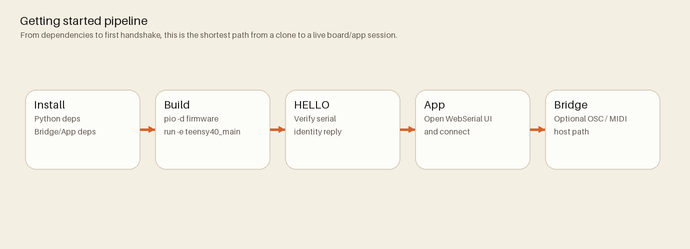

# Getting Started

This page gets a new contributor from clone to first successful handshake.
Canonical source: `docs/project/ProcessOverview.md`



## Prerequisites

- PlatformIO Core on PATH (`pio`)
- Node.js 20.x for bridge/app tooling
- Python 3 for helper scripts and local HTTP serving
- Teensy 4.0 connected over USB

## 1) Install dependencies

From repo root:

```bash
pip install -r requirements.txt
npm --prefix bridge ci
npm --prefix App ci
```

## 2) Build firmware

PlatformIO project root is `firmware/`:

```bash
pio -d firmware run -e teensy40_main
```

Upload:

```bash
pio -d firmware run -e teensy40_main -t upload
```

## 3) Verify serial handshake

Open a serial terminal and send:

```text
HELLO
```

Expected response includes:

```json
{"hello":"mn42"}
```

## 4) Open the WebSerial app

```bash
python3 -m http.server -d App
```

Then visit `http://localhost:8000/`, click Connect, and confirm manifest data appears.

## 5) Optional: run bridge

```bash
node bridge/mn42_bridge.js --serial /dev/ttyACM0 --osc 9000 --osc-listen 9000 --host 127.0.0.1 --bind 127.0.0.1 --midi "MN42 Bridge"
```

Replace `/dev/ttyACM0` with your device path.

## Related docs

- `docs/project/ProcessOverview.md`
- `docs/getting-started/BuildersHandbook.md`
- `docs/validation/Troubleshooting.md`
