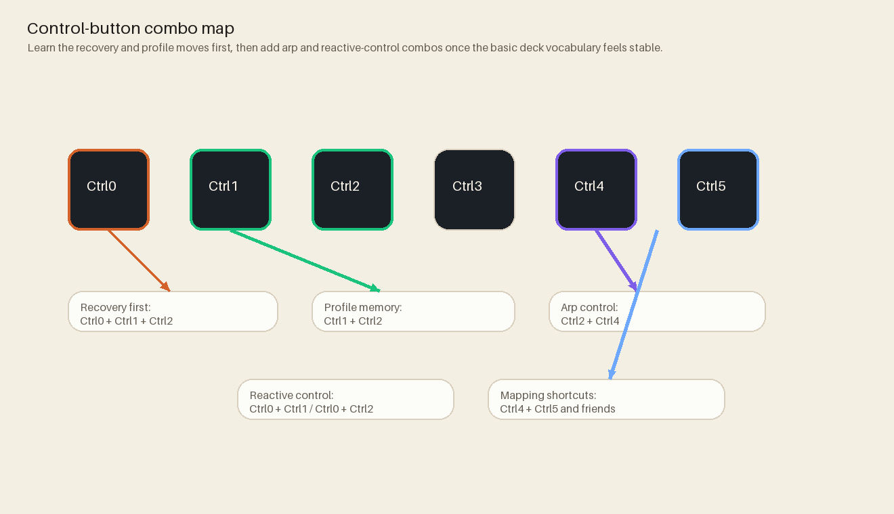

# Hardware

Hardware artifacts live in `hardware/` and supporting diagrams in `docs/sketch/`.
Canonical source: `hardware/README.md`

## Core board characteristics

- Teensy 4.0 controller
- 42-button matrix via multiplexers
- 42 multiplexed physical potentiometer/control slots
- 52 WS2812 LEDs
- 6 envelope follower inputs
- MIDI I/O over DIN and TRS Type-A

## Build and fabrication assets

- [Power, button, and LED schematic](../docs/assets/board/SCH_MOAR_Schematic_1-PWR-BUTTON-LED_2026-08-13.png)
- [Interface, MIDI, and control schematic](../docs/assets/board/SCH_MOAR_Schematic_2-INTERFACE-MIDI-CNTRL_2026-08-13.png)
- [Six-channel envelope schematic](../docs/assets/board/SCH_MOAR_Schematic_3-ENVELOPE_2026-08-13.png)
- [Top](../docs/assets/board/prodTOP.jpg), [bottom](../docs/assets/board/prodBTM.jpg), and [trace-inspection](../docs/assets/board/trace.jpg) board photos
- [Fabrication boundary note](../hardware/fabrication/README.md) (no orderable Gerber/BOM package is currently enclosed)

## Design docs

- Hardware overview: `hardware/README.md`
- Part rationale: `hardware/Parts.md`
- System flow sketches: `docs/sketch/systemFlow/hw/`
- Pin mapping: `docs/reference/PinMap.md`

## Electrical and safety notes

- Use a regulated `5 V DC` supply: `5 V / 4 A` minimum, or `5 V / 5 A` for LED-heavy tests.
- Do not feed `9 V` or `12 V` into the board's VIN path unless a documented regulator or buck stage has been added.
- Keep logic, LED, MIDI, and envelope-follower grounds common.
- Before full-strip white, blast, or burn-in testing, meter whether `F1` and `F2` are parallel branches. If `F2` is downstream of `F1`, the `0.5 A` PTC limits the whole machine; firmware brightness caps do not correct that topology.
- Keep LED power rails wide (>= 0.5mm traces in PCB CAD revisions).
- Respect fused rails and common ground wiring practices.
- Verify power polarity before first boot and rework.
