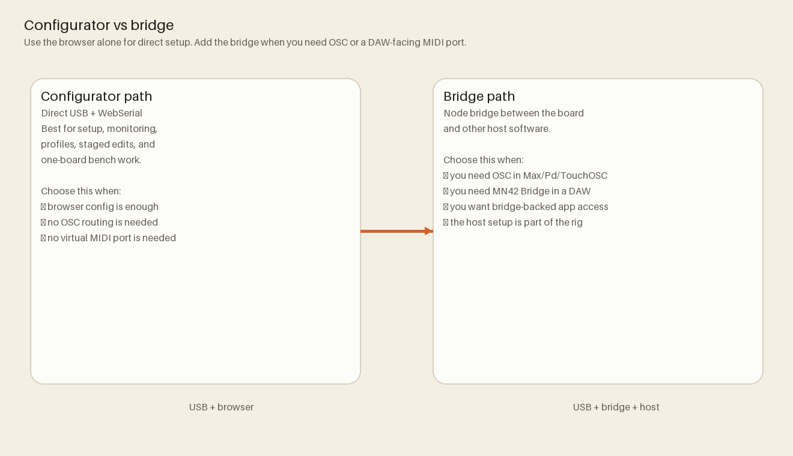

# MOARkNOBS-42 Wiki

MOARkNOBS-42 is an open hardware + firmware + software instrument stack built around a Teensy 4.0 MIDI/OSC controller.

Use this wiki as the fast map. Canonical deep docs remain in the repository source tree.
Canonical source: `README.md`

## Start here

- [Getting Started](Getting-Started.md)
- [System Architecture](System-Architecture.md)
- [Testing](Testing.md)

## Subsystems

- [Firmware](Firmware.md)
- [Hardware](Hardware.md)
- [WebSerial App](WebSerial-App.md)
- [OSC Bridge](OSC-Bridge.md)

## Project operations

- [Release Process](Release-Process.md)
- [History and Roadmap](History-and-Roadmap.md)

## Canonical source docs

- Root overview: `README.md`
- Docs index: `docs/README.md`
- Firmware details: `firmware/README.md`
- Bridge details: `bridge/README.md`
- App details: `App/README.md`
