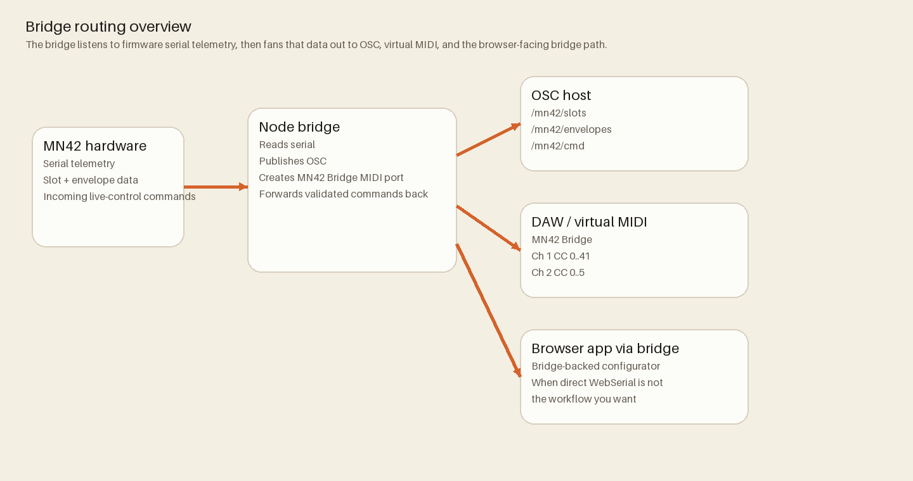

# OSC Bridge

The bridge (`bridge/`) is a Node.js CLI that connects firmware serial telemetry to OSC and virtual MIDI.
Canonical source: `bridge/README.md`



## Install

```bash
npm --prefix bridge ci
```

## Run

```bash
node bridge/mn42_bridge.js --serial /dev/ttyACM0 --osc 9000 --osc-listen 9000 --host 127.0.0.1 --bind 127.0.0.1 --midi "MN42 Bridge"
```

## Behavior summary

- Reads JSON telemetry from serial.
- Publishes slot/envelope updates to OSC.
- Exposes virtual MIDI device for host DAW workflows.
- Accepts inbound OSC/MIDI commands and forwards validated control commands to firmware.

## OSC contract

- Outbound:
  - `/mn42/slots` (42 values)
  - `/mn42/envelopes` (6 values)
- Inbound:
  - `/mn42/cmd` with `{ "cmd":"SET_POT", "slot":n, "value":v }`

## Tests

```bash
npm --prefix bridge test
```

## Reference docs

- `bridge/README.md`
- `docs/guides/OSCBridge.md`
- `docs/guides/BridgeForPerformers.md`
- `docs/release/BridgePackaging.md`
