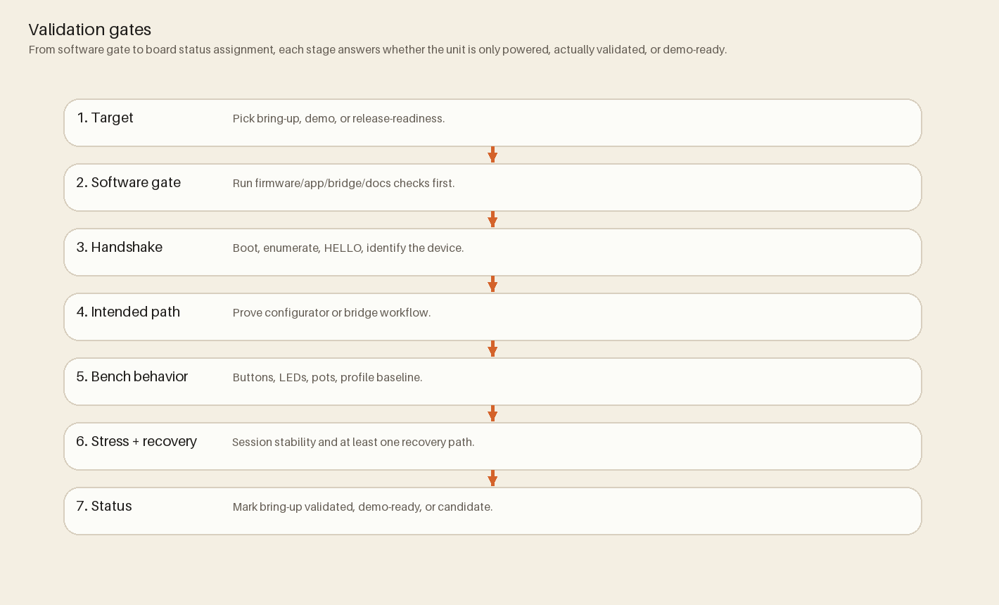

# Release Process

Use this as the release checklist summary. Detailed runbooks remain in `docs/release/ReleaseGuide.md`.
Canonical source: `docs/release/ReleaseGuide.md`



## Current boundary

The current safe claim is **hardware-test package**, not beta, public, or fabrication-ready. A passing software suite or generated artifact does not widen that claim. Beta and public releases additionally require the dated hardware, host, recovery, packaging/signing, and support evidence listed in `docs/release/ReleaseBoundaryIndex.md` and `docs/release/ReleaseCriteria.md`.

Use the steps below to prepare and verify a candidate inside that boundary. Do not describe it as beta or public unless those wider gates have dated evidence.

## Firmware release steps

1. Build and test:
   ```bash
   pio run -d firmware -e teensy40_main
   pio test -d firmware -e teensy40_unity -vvv
   npm --prefix bridge test
   npm --prefix App test
   ```
2. Update version constants (for example `firmware/include/Globals.h`).
3. Update `CHANGELOG.md`.
4. Commit release prep changes.
5. Tag release:
   ```bash
   git tag -a vX.Y.Z -m "vX.Y.Z"
   git push origin vX.Y.Z
   ```
6. Draft GitHub release and attach required artifacts/licenses.

## Bridge packaging lane

When shipping non-CLI bridge artifacts:

1. Follow `docs/release/BridgePackaging.md`.
2. Run bridge smoke tests per target OS.
3. Publish checksums and artifacts.
4. Complete `docs/release/bridge-artifacts-checklist.md`.

## Reference docs

- `docs/release/ReleaseGuide.md`
- `docs/release/ReleaseBoundaryIndex.md`
- `docs/release/ReleaseCriteria.md`
- `docs/release/bridge-artifacts-checklist.md`
- `CHANGELOG.md`
