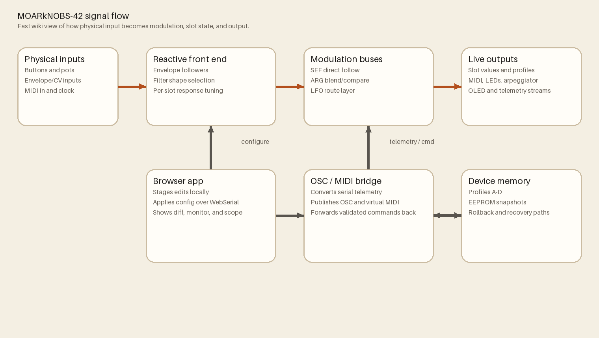

# System Architecture

MOARkNOBS-42 has four main layers:
Canonical source: `README.md`

1. Hardware controller (Teensy + buttons + pots + LEDs + envelope inputs + MIDI I/O)
2. Firmware runtime (schedulers, protocol, managers, persistence)
3. WebSerial configuration app (`App/`)
4. Node OSC/MIDI bridge (`bridge/`)

## Data flow

1. Human input enters from button matrix, control buttons, pots, and envelope follower analog inputs.
2. Firmware updates slot state, modulation state (EF/ARG/LFO/arp), and output buses.
3. Firmware emits MIDI and telemetry over serial/WebSerial.
4. Bridge converts telemetry to OSC/MIDI and forwards external commands back to firmware.
5. Web app stages config, validates schema, and applies updates via serial protocol.

## Firmware runtime organization

- `SystemState`: shared object ownership and wiring
- `Protocol`: serial command handling + JSON/RPC contract
- `Modes`: profile + slot behavior
- `UI`: OLED/LED/button interaction layer
- `Runtime`: scheduler servicing and task orchestration

## Persistent configuration

- EEPROM stores config + profile snapshots
- Recovery path supports backup block fallback
- Profiles A-D contain modulation and routing state

## Primary source references

- `README.md` (root architecture narrative)
- `firmware/README.md` (runtime details)
- `docs/guides/WebSerial.md` (host contract and message flow)
- `docs/guides/OSCBridge.md` (bridge transport behavior)
