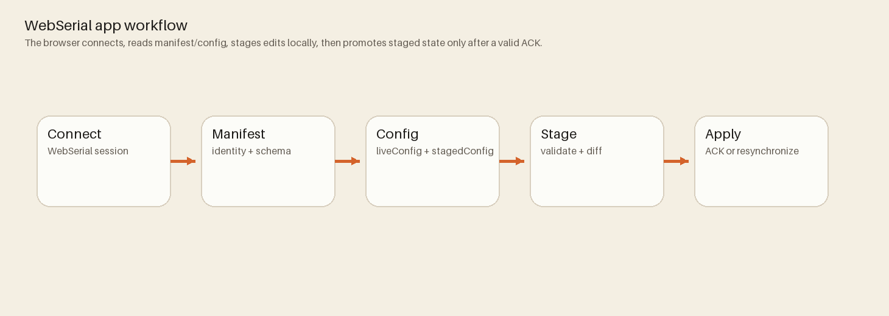
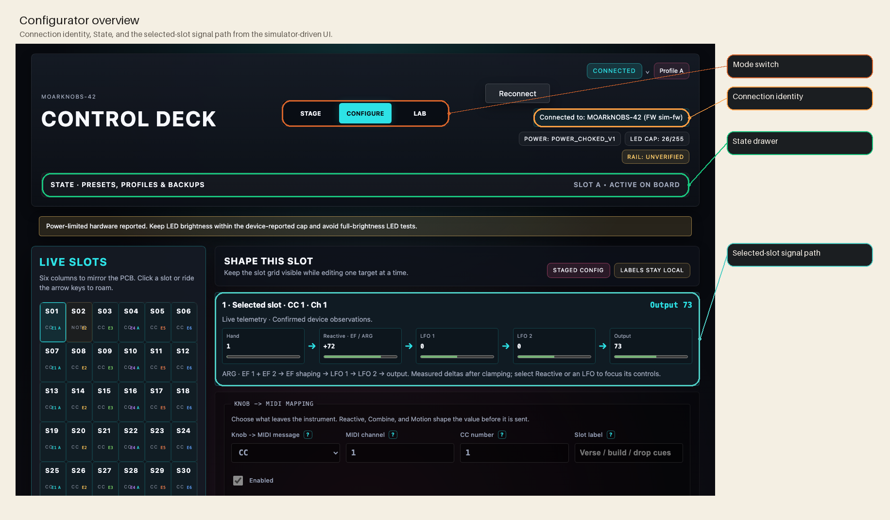
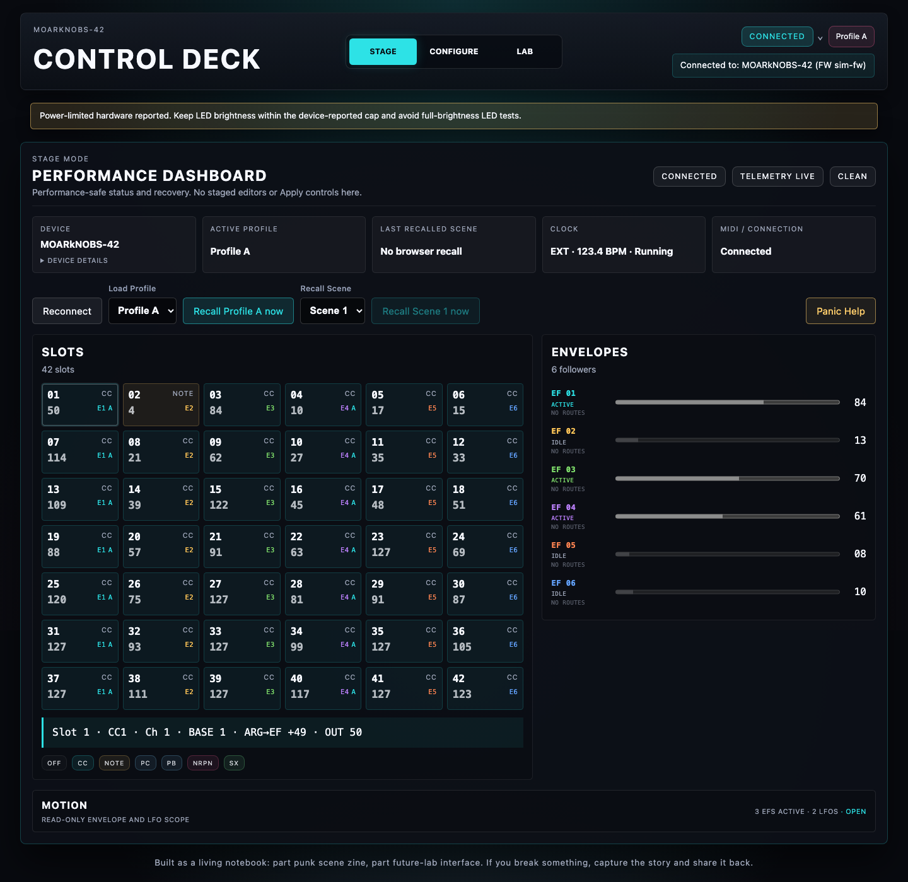
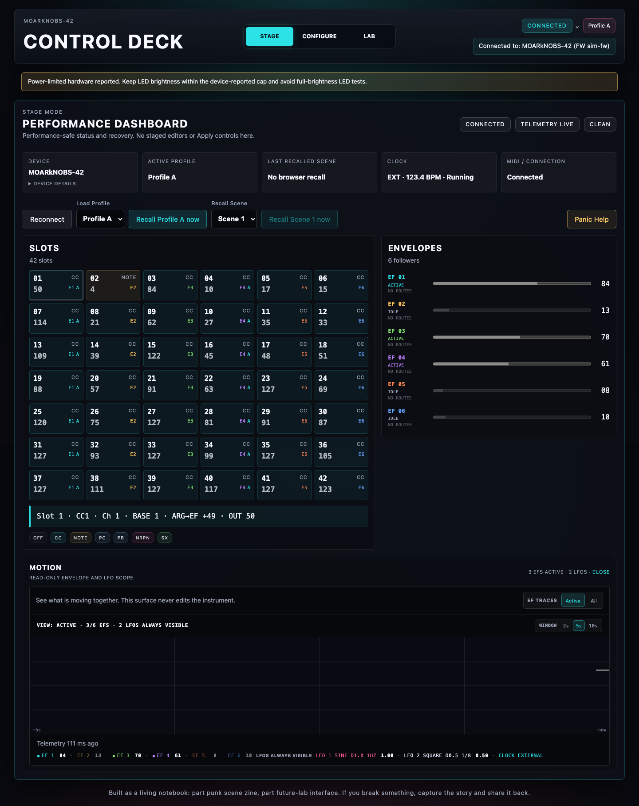
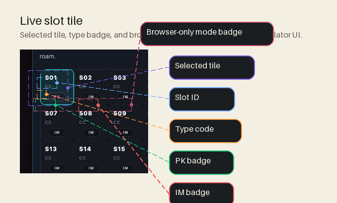

# WebSerial App

The browser configurator lives in `App/` and provides schema-validated editing against the firmware protocol.
Canonical source: `App/README.md`



## Architecture

- `App/runtime.js` - transport, schema validation, staging/diff/rollback, simulator
- `App/views/benzknobz.js` - UI rendering + event wiring
- `App/config_schema.json` - configuration schema contract
- `App/views/form_renderer.js` - schema-driven editor controls



## Local run

```bash
python3 -m http.server -d App
```

Open `http://localhost:8000/`.

## Core workflow

1. Connect via WebSerial.
2. Read manifest/config from firmware.
3. Stage edits locally.
4. Validate against schema.
5. Apply and confirm checksum/ACK.
6. Confirm the receipt and device readback; ambiguous outcomes enter resynchronization.

For a finished instrument, start with [Getting Started](Getting-Started.md) or
the [First Playable Walkthrough](Playable-Walkthrough.md) before reading the
runtime architecture below.


## User-facing capabilities

- **Stage**: a performance-safe dashboard with live profile/scene recall, slot
  activity, envelope levels, clock and connection state, and panic help. It
  deliberately has no staged editors or Apply controls.
- **Configure**: the everyday mapping workspace for Basic editing.
- **Lab**: the advanced workspace for EF/ARG/fixed-LFO, scope, diagnostics,
  import/export, and other technical controls.
- Profile load/save/reset flow
- Staged diff visibility
- MIDI monitor and optional clock output
- Simulator transport for hardware-free testing



## Stage during a performance

Choose **Stage** in the top mode switch (or open with `?mode=stage`) when the
instrument is already configured and the priority is safe observation and
recall. Its values are telemetry, not a promise of source-device timing or a
latency measurement. A delayed or stale value remains visible but is
de-emphasized; do not treat it as live.

Stage blocks profile and scene recall while a staged draft exists. Return to
Configure or Lab to **Apply** or **Discard draft**, then recall the intended
profile or scene. Browser-local profile names are operator hints; they do not
modify the firmware profile.

The collapsed **Motion** panel is read-only. It retains envelope/LFO history
while closed, offers Active/All EF trace visibility and a 2/5/10-second view,
and pauses its canvas animation until opened. LFO traces remain visible in both
EF views.



## Save, recall, and back up

1. Apply the staged configuration and wait until device authority is verified.
2. Save the clean live configuration into profile A-D.
3. Load a profile to replace live state with that saved device state.
4. Download a JSON copy when the setup also needs an off-device backup.

Current profiles are stored through generation-backed LittleFS persistence.
Preset selection is browser-side staging; it is not a saved device profile
until Apply and profile save both complete.

## If Apply or connection fails

Do not interpret a missing receipt as rollback. Follow the status shown by the
App, then use [Troubleshooting by Symptom](Troubleshooting.md).



## Tests

```bash
npm --prefix App test
```

The current Stage captures are produced by the checked-in Playwright simulator
test `App/tests/mode_screenshots.spec.js`. Regenerate the artifacts before
replacing these images; do not present simulator values as hardware evidence.

## Reference docs

- `App/README.md`
- `docs/guides/WebSerial.md`
- `docs/reference/ConfigurationTransactionModel.md`
- `docs/reference/PersistenceContract.md`
